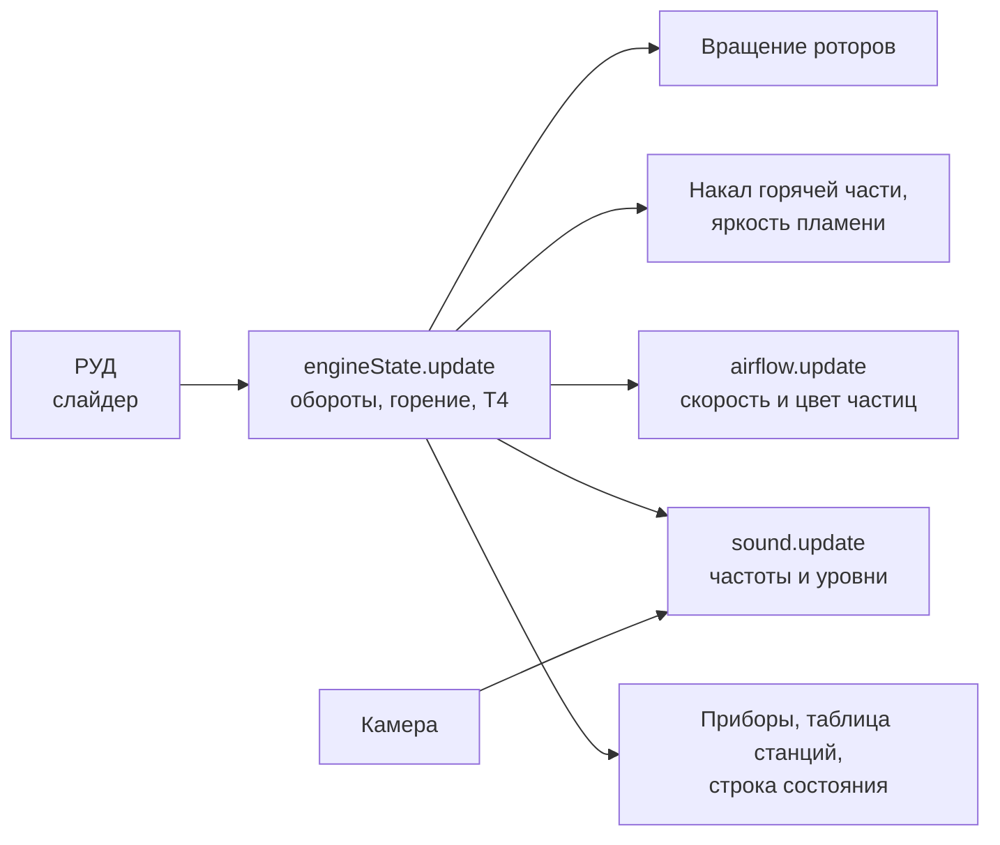

# 01. Архитектура

## Модули

```mermaid
graph TD
  I[index.html<br/>разметка панели и легенды] --> M
  M[main.js<br/>сцена, свет, постобработка,<br/>вырез, UI, цикл анимации]
  M --> E[engine.js<br/>геометрия узлов,<br/>материалы, метки]
  M --> A[airflow.js<br/>частицы, линии тока, струя]
  M --> H[heathaze.js<br/>выхлопные газы:<br/>искажение и видимая струя]
  M --> S[sound.js<br/>синтез звука]
  M --> ST[engineState.js<br/>автомат режимов]
  E --> B[blade.js<br/>генератор лопаток]
  ST -.проверяется.-> T[test/engine-state.test.mjs]
  ST -.проверяется.-> T2[test/heat-haze.test.mjs]
  E -.проверяется.-> T3[test/spiral-blur.test.mjs]
  E -.проверяется.-> T4["test/geometry.test.mjs<br/>test/clearance.test.mjs"]
  J[["docs/engines/*.json<br/>справочник по прототипу"]] -.эталон.-> T4
  H -.проверяется.-> T2
  style ST fill:#1c3a4d,stroke:#4fc3ff
  style T fill:#1c3a4d,stroke:#4fc3ff
  style T2 fill:#1c3a4d,stroke:#4fc3ff
  style T3 fill:#1c3a4d,stroke:#4fc3ff
  style T4 fill:#1c3a4d,stroke:#4fc3ff
```



Зависимости однонаправленные. Два модуля намеренно не знают ни про Three.js,
ни про DOM:

* **`engineState.js`** — чистая логика режимов, поэтому её можно прогнать
  в Node и проверить числами (`npm test`);
* **`sound.js`** — принимает подменный аудиоконтекст, поэтому граф можно
  отрендерить в `OfflineAudioContext` и измерить результат.

Это не абстракция ради абстракции: без неё выбег ротора нечем было бы проверить,
кроме как смотреть на экран.

| Файл | Строк | Ответственность |
|---|---:|---|
| `src/engine.js` | 1158 | Вся геометрия двигателя, материалы, прокси для выбора узлов |
| `src/main.js` | 508 | Сцена, освещение, постобработка, вырез, UI, цикл кадра |
| `src/sound.js` | 345 | Синтез звука на Web Audio |
| `src/airflow.js` | 329 | Каналы потоков, частицы, линии тока, реактивная струя |
| `src/style.css` | 302 | Оформление панелей |
| `src/heathaze.js` | 357 | Экранный проход выхлопных газов за соплом |
| `src/blade.js` | 161 | Процедурная геометрия лопаток и венцов |
| `index.html` | 139 | Разметка панели, легенды, карточки узла |
| `src/engineState.js` | 104 | Автомат режимов: запуск, работа, останов, выбег |

## Поток данных в кадре



Единственный источник истины о состоянии двигателя — объект `eng` из
`createEngineState()`. Слайдер задаёт только положение РУД; фактические обороты,
горение и температура считаются в автомате, и уже от них зависят вращение,
свечение, потоки, звук и приборы. Поэтому при останове всё гаснет согласованно.

## Граф сцены

Двигатель разбит на модули — они же единицы разнесения и выбора:

```
engine.root
├── nacelle    мотогондола, кромка воздухозаборника, пилон
├── fan        корпус вентилятора, спрямляющий аппарат │ ротор N1: кок, диск, 24 лопатки
├── booster    разделитель контуров, направляющие аппараты │ ротор N1: 3 ступени
├── hpc        корпус, 9 направляющих аппаратов │ ротор N2: барабан, 9 ступеней
├── combustor  диффузор, жаровая труба, купол, 20 форсунок, пламя
├── hpt        корпус, сопловой аппарат │ ротор N2: 1 ступень, диск
├── lpt        корпус, сопловые аппараты │ ротор N1: 4 ступени, диски
├── exhaust    10 стоек задней опоры, сопло, центральное тело
├── cowl       внутренний обвод наружного контура
├── shafts     ротор N1: вал НД │ ротор N2: вал ВД │ подшипниковые опоры
└── accessory  коробка приводов, агрегаты, трубопроводы
```

Вращающиеся подгруппы собраны в два массива — `n1Rotors` и `n2Rotors`. Каждый
кадр всем группам одного каскада присваивается общий угол, поэтому роторы
остаются синхронными даже при разнесении узлов, когда их родительские модули
разъезжаются в стороны.

## Производительность

* Каждый венец лопаток — один `InstancedMesh`: геометрия хранится один раз,
  матрицы поворота задаются по числу лопаток. Около 1500 лопаток дают порядка
  50 вызовов отрисовки и ~850 тыс. треугольников.
* Выбор узла мышью идёт **не** по реальной геометрии, а по невидимым
  прокси-цилиндрам (`engine.pickables`, 11 объектов): raycast по 850 тыс.
  треугольников на каждое движение мыши был бы неприемлемо дорог. Материал
  прокси имеет `visible: false` — он не рендерится, но остаётся видимым для
  трассировки лучей.
* При включённом разрезе или прозрачных корпусах прокси оболочек исключаются
  из выбора, чтобы можно было ткнуть в то, что под ними.
* `dt` в цикле ограничен 0.05 с: при просадке кадров модель замедляется, но не
  «прыгает» через состояния.

## Постобработка

`EffectComposer` → `RenderPass` → **выхлопные газы** → `UnrealBloomPass` →
`OutputPass`. Тональная компрессия — ACES Filmic, экспозиция 0.82. Сила свечения
привязана к накалу горячей части, поэтому на выключенном двигателе картинка
не «светится».

Проход выхлопа стоит **до** свечения: иначе ореолы вокруг раскалённых деталей
оставались бы неподвижными, пока сами детали дрожат. Когда двигатель холодный,
проход целиком выключается (`pass.enabled = false`) и ничего не стоит —
см. [документ о потоках](04-airflow.md#выхлопные-газы).
