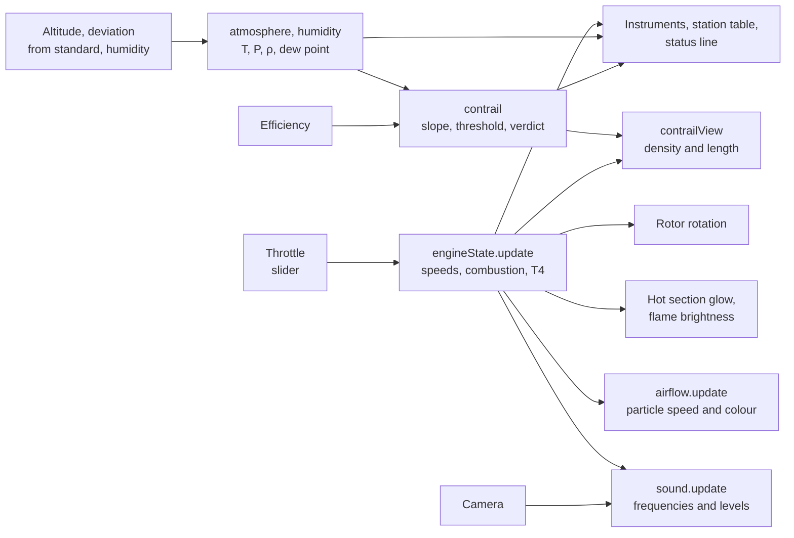

# 01. Architecture

## Modules

```mermaid
graph TD
  I[index.html<br/>panel and legend markup] --> M
  M[main.js<br/>scene, lighting, post-processing,<br/>cutaway, UI, animation loop]
  M --> E[engine.js<br/>module geometry,<br/>materials, labels]
  M --> A[airflow.js<br/>particles, streamlines, plume]
  M --> H[heathaze.js<br/>exhaust gas:<br/>distortion and visible jet]
  M --> S[sound.js<br/>sound synthesis]
  M --> ST[engineState.js<br/>regime state machine]
  M --> AT[atmosphere.js<br/>ambient conditions]
  M --> CT[contrail.js<br/>Schmidt — Appleman criterion]
  M --> CV[contrailView.js<br/>the trail itself]
  E --> B[blade.js<br/>blade generator]
  ST -.checked by.-> T[test/engine-state.test.mjs]
  ST -.checked by.-> T2[test/heat-haze.test.mjs]
  E -.checked by.-> T3[test/spiral-blur.test.mjs]
  E -.checked by.-> T4["test/geometry.test.mjs<br/>test/clearance.test.mjs"]
  AT -.checked by.-> T5[test/atmosphere.test.mjs]
  CT -.checked by.-> T6[test/contrail.test.mjs]
  AT --> CT --> CV
  J[["docs/engines/*.json<br/>prototype reference data"]] -.the yardstick.-> T4
  H -.checked by.-> T2
  style ST fill:#1c3a4d,stroke:#4fc3ff
  style AT fill:#1c3a4d,stroke:#4fc3ff
  style T fill:#1c3a4d,stroke:#4fc3ff
  style T2 fill:#1c3a4d,stroke:#4fc3ff
  style T3 fill:#1c3a4d,stroke:#4fc3ff
  style T4 fill:#1c3a4d,stroke:#4fc3ff
  style T5 fill:#1c3a4d,stroke:#4fc3ff
  style CT fill:#1c3a4d,stroke:#4fc3ff
  style T6 fill:#1c3a4d,stroke:#4fc3ff
```



Dependencies run one way. Four modules deliberately know nothing about either
Three.js or the DOM:

* **`engineState.js`** — pure regime logic, so it can be run under Node and
  checked numerically (`npm test`);
* **`atmosphere.js`** — the standard atmosphere and water vapour, checked
  against the published tables for the same reason;
* **`contrail.js`** — the formation criterion, separated from the drawing in
  `contrailView.js` for the same reason;
* **`sound.js`** — accepts a substitute audio context, so the graph can be
  rendered in an `OfflineAudioContext` and measured.

This is not abstraction for its own sake: without it there would be no way to
check the rotor rundown other than watching the screen.

| File | Lines | Responsibility |
|---|---:|---|
| `src/engine.js` | 1243 | All engine geometry, materials, proxies for module picking |
| `src/main.js` | 726 | Scene, lighting, post-processing, cutaway, UI, frame loop |
| `src/heathaze.js` | 360 | Screen-space pass for the exhaust gas aft of the nozzle |
| `src/sound.js` | 351 | Sound synthesis on Web Audio |
| `src/style.css` | 334 | Panel styling |
| `src/airflow.js` | 333 | Flow ducts, particles, streamlines, exhaust plume |
| `index.html` | 192 | Markup of the panel, the legend and the module card |
| `src/blade.js` | 162 | Procedural geometry of blades and rows |
| `src/contrail.js` | 160 | Schmidt — Appleman criterion: does a trail form, and does it last |
| `src/contrailView.js` | 158 | The trail itself: a camera-facing strip along the axis |
| `src/engineState.js` | 150 | Regime state machine: start, running, shutdown, rundown |
| `src/atmosphere.js` | 143 | Standard atmosphere and water vapour: ambient conditions of the day |

## Data flow within a frame



The ambient conditions enter the picture from the side and reach the station
table and the contrail: nothing inside the engine depends on them. The traffic
in the other direction is one number - the combustion, without which there is no
water in the exhaust and no trail.

The single source of truth about the engine is the `eng` object returned by
`createEngineState()`. The slider only sets the throttle position; the actual
speeds, combustion and temperature are computed in the state machine, and it is
those that drive rotation, glow, flows, sound and instruments. That is why
everything dies together on shutdown.

## Scene graph

The engine is split into modules — which are also the units of exploding and
picking:

```
engine.root
├── nacelle    nacelle, intake lip, pylon
├── fan        fan case, outlet guide vanes │ N1 rotor: spinner, disc, 24 blades
├── booster    flow splitter, stator vanes │ N1 rotor: 3 stages
├── hpc        casing, 9 stator rows │ N2 rotor: drum, 9 stages
├── combustor  diffuser, flame tube, dome, 20 fuel nozzles, flame
├── hpt        casing, nozzle guide vanes │ N2 rotor: 1 stage, disc
├── lpt        casing, nozzle guide vanes │ N1 rotor: 4 stages, discs
├── exhaust    10 rear frame struts, nozzle, plug
├── cowl       inner wall of the bypass duct
├── shafts     N1 rotor: LP shaft │ N2 rotor: HP shaft │ bearing supports
└── accessory  accessory gearbox, accessories, pipework
```

The rotating subgroups are collected into two arrays — `n1Rotors` and
`n2Rotors`. Every frame all groups of one spool are assigned a common angle, so
the rotors stay in sync even in the exploded view, when their parent modules
have moved apart.

## Performance

* Every blade row is a single `InstancedMesh`: the geometry is stored once and
  the rotation matrices are supplied per blade. There are 37 rows holding 2341
  blades:

  | Module | Rows | Blades |
  |---|---:|---:|
  | Fan (with OGV) | 3 | 69 |
  | Booster | 6 | 264 |
  | HP compressor | 18 | 1242 |
  | HP turbine | 2 | 106 |
  | LP turbine | 8 | 660 |

  Plus the ten rear frame struts built the same way. That comes to about
  **758 thousand triangles** and **123 draw calls** — of which the rows account
  for 38, the rest being made up by individual meshes: casings, barrels, discs,
  the 20 fuel nozzles, the pipework.
* Module picking goes **not** through the real geometry but through invisible
  proxy cylinders (`engine.pickables`, 11 objects — one per module): raycasting
  758 thousand triangles on every mouse move would be unacceptably expensive.
  The proxy material has `visible: false` — it is not rendered, but stays
  visible to ray tracing.
* With the cutaway or the transparent casings switched on, the shell proxies are
  excluded from picking, so that whatever is underneath can be clicked.
* `dt` in the loop is capped at 0.05 s: when the frame rate drops the model
  slows down rather than jumping over states.

## Post-processing

`EffectComposer` → `RenderPass` → **exhaust gas** → `UnrealBloomPass` →
`OutputPass`. Tone mapping is ACES Filmic at an exposure of 0.82. The bloom
strength is tied to the glow of the hot section, so a shut-down engine does not
sit there glowing.

The exhaust pass comes **before** the bloom: otherwise the halos around
red-hot parts would stay put while the parts themselves shimmer. When the engine
is cold the pass is switched off entirely (`pass.enabled = false`) and costs
nothing — see the [airflow document](04-airflow.md#exhaust-gas).
