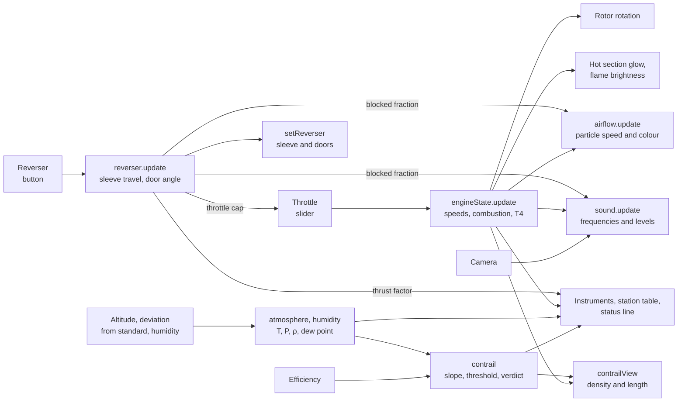

# 01. Architecture

## Modules

```mermaid
graph TD
  I[index.html<br/>panel and legend markup] --> M
  M[main.js<br/>scene, lighting, post-processing,<br/>cutaway, UI, animation loop]
  M --> E[engine.js<br/>module geometry,<br/>materials, labels]
  M --> A[airflow.js<br/>particles, streamlines, plume]
  M --> H[heathaze.js<br/>exhaust gas:<br/>distortion and visible jet]
  M --> S[sound.js<br/>sound synthesis]
  M --> ST[engineState.js<br/>regime state machine]
  M --> RV[reverser.js<br/>sleeve, blocker door linkage,<br/>reverse thrust]
  M --> AT[atmosphere.js<br/>ambient conditions]
  M --> CT[contrail.js<br/>Schmidt — Appleman criterion]
  M --> CV[contrailView.js<br/>the trail itself]
  M --> L[i18n.js<br/>lookup, interpolation,<br/>number formatting]
  L --> LOC[["locales/*.js<br/>eight dictionaries"]]
  E --> RV
  E --> B[blade.js<br/>blade generator]
  E --> LV[livery.js<br/>markings on the<br/>nacelle skin]
  L -.checked by.-> T7[test/i18n.test.mjs]
  ST -.checked by.-> T[test/engine-state.test.mjs]
  RV -.checked by.-> T8[test/reverser.test.mjs]
  ST -.checked by.-> T2[test/heat-haze.test.mjs]
  E -.checked by.-> T3[test/spiral-blur.test.mjs]
  E -.checked by.-> T4["test/geometry.test.mjs<br/>test/clearance.test.mjs"]
  AT -.checked by.-> T5[test/atmosphere.test.mjs]
  CT -.checked by.-> T6[test/contrail.test.mjs]
  AT --> CT --> CV
  J[["docs/engines/*.json<br/>prototype reference data"]] -.the yardstick.-> T4
  H -.checked by.-> T2
  style ST fill:#1c3a4d,stroke:#4fc3ff
  style AT fill:#1c3a4d,stroke:#4fc3ff
  style T fill:#1c3a4d,stroke:#4fc3ff
  style T2 fill:#1c3a4d,stroke:#4fc3ff
  style T3 fill:#1c3a4d,stroke:#4fc3ff
  style T4 fill:#1c3a4d,stroke:#4fc3ff
  style T5 fill:#1c3a4d,stroke:#4fc3ff
  style CT fill:#1c3a4d,stroke:#4fc3ff
  style T6 fill:#1c3a4d,stroke:#4fc3ff
  style L fill:#1c3a4d,stroke:#4fc3ff
  style T7 fill:#1c3a4d,stroke:#4fc3ff
  style RV fill:#1c3a4d,stroke:#4fc3ff
  style T8 fill:#1c3a4d,stroke:#4fc3ff
```



Dependencies run one way. Six modules deliberately know nothing about either
Three.js or the DOM:

* **`engineState.js`** — pure regime logic, so it can be run under Node and
  checked numerically (`npm test`);
* **`atmosphere.js`** — the standard atmosphere and water vapour, checked
  against the published tables for the same reason;
* **`contrail.js`** — the formation criterion, separated from the drawing in
  `contrailView.js` for the same reason;
* **`sound.js`** — accepts a substitute audio context, so the graph can be
  rendered in an `OfflineAudioContext` and measured;
* **`reverser.js`** — the deployment state machine, the drag-link kinematics of
  the blocker doors and the thrust factor. A deployment takes two seconds and
  the interesting part of it is what the interlocks refuse to do, neither of
  which can be judged from a screenshot. It is the one of the six that another
  module imports rather than only `main.js`: `engine.js` needs the door angle,
  because the door geometry IS the linkage and a second copy of that curve in
  the geometry would be a second authority for it;
* **`i18n.js`** — lookup, `{placeholder}` interpolation, number formatting and
  matching the reader's languages against the eight we have. Kept pure because
  eight dictionaries drift apart in silence: a key added to the English and
  forgotten elsewhere costs nothing at build time and surfaces as an English
  word in the middle of a Japanese panel. Comparing them key by key is only
  possible if nothing here needs a browser.

This is not abstraction for its own sake: without it there would be no way to
check the rotor rundown other than watching the screen.

| File | Lines | Responsibility |
|---|---:|---|
| `src/locales/*.js` | 1416 | Eight dictionaries, 141 keys each |
| `src/engine.js` | 1614 | All engine geometry, materials, proxies for module picking |
| `src/main.js` | 901 | Scene, lighting, post-processing, cutaway, UI, frame loop |
| `src/heathaze.js` | 367 | Screen-space pass for the exhaust gas aft of the nozzle |
| `src/style.css` | 359 | Panel styling |
| `src/sound.js` | 386 | Sound synthesis on Web Audio |
| `src/airflow.js` | 390 | Flow ducts, particles, streamlines, exhaust plume |
| `src/contrailView.js` | 220 | The trail itself: a camera-facing strip along the axis |
| `index.html` | 233 | Markup of the panel, the legend and the module card |
| `src/livery.js` | 348 | Joints, service doors and titles painted on the nacelle skin |
| `src/blade.js` | 162 | Procedural geometry of blades and rows |
| `src/contrail.js` | 160 | Schmidt — Appleman criterion: does a trail form, and does it last |
| `src/engineState.js` | 163 | Regime state machine: start, running, shutdown, rundown, gross thrust |
| `src/reverser.js` | 241 | Thrust reverser: deployment, door linkage, reverse thrust |
| `src/atmosphere.js` | 143 | Standard atmosphere and water vapour: ambient conditions of the day |
| `src/i18n.js` | 96 | Lookup, interpolation, number formatting, locale matching |

`engine.js` gained 376 lines to the thrust reverser, which is the largest single
addition it has taken: the aft nacelle is now a module of its own with a
translating sleeve, a cascade box and twelve blocker doors on a linkage.

## Data flow within a frame



The reverser is updated **before** the engine: the cap it puts on the throttle
belongs to this frame's sleeve position rather than the last one. It takes the
same time scale as the engine — a start run at ×4 with a sleeve moving at ×1
would be two clocks in one scene.

The ambient conditions enter the picture from the side and reach the station
table and the contrail: nothing inside the engine depends on them. The traffic
in the other direction is one number - the combustion, without which there is no
water in the exhaust and no trail.

The single source of truth about the engine is the `eng` object returned by
`createEngineState()`. The slider only sets the throttle position; the actual
speeds, combustion and temperature are computed in the state machine, and it is
those that drive rotation, glow, flows, sound and instruments. That is why
everything dies together on shutdown.

## Scene graph

The engine is split into modules — which are also the units of exploding and
picking:

```
engine.root
├── nacelle    nacelle, intake lip, pylon
├── fan        fan case, outlet guide vanes │ N1 rotor: spinner, disc, 24 blades
├── booster    flow splitter, stator vanes │ N1 rotor: 3 stages
├── hpc        casing, 9 stator rows │ N2 rotor: drum, 9 stages
├── combustor  diffuser, flame tube, dome, 20 fuel nozzles, flame
├── hpt        casing, nozzle guide vanes │ N2 rotor: 1 stage, disc
├── lpt        casing, nozzle guide vanes │ N1 rotor: 4 stages, discs
├── exhaust    10 rear frame struts, nozzle, plug
├── cowl       inner wall of the bypass duct
├── shafts     N1 rotor: LP shaft │ N2 rotor: HP shaft │ bearing supports
└── accessory  accessory gearbox, accessories, pipework
```

The rotating subgroups are collected into two arrays — `n1Rotors` and
`n2Rotors`. Every frame all groups of one spool are assigned a common angle, so
the rotors stay in sync even in the exploded view, when their parent modules
have moved apart.

## Performance

* Every blade row is a single `InstancedMesh`: the geometry is stored once and
  the rotation matrices are supplied per blade. There are 37 rows holding 2350
  blades:

  | Module | Rows | Blades |
  |---|---:|---:|
  | Fan (with OGV) | 3 | 69 |
  | Booster | 6 | 264 |
  | HP compressor | 18 | 1242 |
  | HP turbine | 2 | 106 |
  | LP turbine | 8 | 660 |

  Plus the ten rear frame struts built the same way. That comes to about
  **777 thousand triangles** and **132 draw calls** — of which the blade rows
  account for 37, the rest being made up by individual meshes: casings, barrels,
  discs, the 20 fuel nozzles, the pipework.

  (The blade count read 2341 here for a long time and was nine out. The rows
  were right.)
* Instancing is not only for blades. The thrust reverser is twelve doors at one
  angle, twelve identical drag links, twelve cascade ribs and 288 turning
  vanes, and as separate meshes it cost 51 draw calls on its own — more than a
  third of the scene for one assembly. As five `InstancedMesh`es it costs 9,
  and the doors and links have their matrices rewritten only when the sleeve
  moves.
* Module picking goes **not** through the real geometry but through invisible
  proxy cylinders (`engine.pickables`, 12 objects — one per module): raycasting
  777 thousand triangles on every mouse move would be unacceptably expensive.
  The proxy material has `visible: false` — it is not rendered, but stays
  visible to ray tracing.
* With the cutaway or the transparent casings switched on, the shell proxies are
  excluded from picking, so that whatever is underneath can be clicked.
* `dt` in the loop is capped at 0.05 s: when the frame rate drops the model
  slows down rather than jumping over states.

## Post-processing

`EffectComposer` → `RenderPass` → **exhaust gas** → `UnrealBloomPass` →
`OutputPass`. Tone mapping is ACES Filmic at an exposure of 0.82. The bloom
strength is tied to the glow of the hot section, so a shut-down engine does not
sit there glowing.

The exhaust pass comes **before** the bloom: otherwise the halos around
red-hot parts would stay put while the parts themselves shimmer. When the engine
is cold the pass is switched off entirely (`pass.enabled = false`) and costs
nothing — see the [airflow document](04-airflow.md#exhaust-gas).
