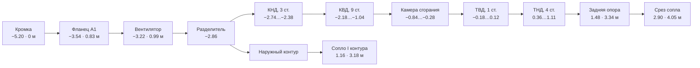

# 02. Геометрия двигателя

## Система координат и масштаб

Ось двигателя — **X**, поток идёт в направлении **+X**. Радиальное направление
лопатки при построении — **+Y**, окружная координата отсчитывается в плоскости
YZ.

1 условная единица = **0.50 м**. Из-за этого множителя радиус в условных
единицах численно равен диаметру в метрах — `fanTip = 1.549` это вентилятор
Ø 1.549 м, `nacelleR = 2.44` это гондола Ø 2.44 м. Совпадение удобное:
справочные диаметры переносятся в код без пересчёта.

Продольные станции отсчитываются от передней кромки воздухозаборника; она
стоит в `x = −5.2`, поэтому станция в метрах от кромки равна `(x + 5.2) / 2`.
Полная длина модели от кромки до конца центрального тела — 10.0 у.е. = 5.0 м.

Все габариты взяты из справочника
[`engines/cfm56-7b-nacelle.json`](engines/cfm56-7b-nacelle.json) — см.
[«Габариты по источникам»](#габариты-по-источникам) ниже.

Тела вращения строятся через `LatheGeometry` по профилю `[радиус, координата X]`
и разворачиваются `rotation.z = -π/2`, чтобы ось вращения совпала с осью X.
Замкнутый профиль (наружная обшивка назад, внутренняя вперёд) даёт оболочку
с толщиной за одну операцию — так сделаны мотогондола, корпуса и капоты.

## Станции газовоздушного тракта

Константы объявлены в `ST` (`src/engine.js`):



| Станция | X, у.е. | м от кромки | Что там |
|---|---:|---:|---|
| `lip` | −5.20 | 0 | Передняя кромка (highlight), Ø 1.70 м |
| `throat` | −4.94 | 0.13 | Горло воздухозаборника, Ø 1.52 м |
| `a1` | −3.54 | 0.83 | Фланец A1: стык с корпусом вентилятора |
| `fan` | −3.22 | 0.99 | Плоскость вентилятора, радиус конца лопатки 1.549 |
| `splitter` | −2.86 | 1.17 | Разделитель контуров |
| `boosterIn…Out` | −2.74…−2.38 | 1.23…1.41 | Подпорные ступени, 3 |
| `hpcIn…Out` | −2.18…−1.04 | 1.51…2.08 | Компрессор высокого давления, 9 |
| `combIn…Out` | −0.84…−0.28 | 2.18…2.46 | Кольцевая камера сгорания |
| `hptIn…Out` | −0.18…0.12 | 2.51…2.66 | Турбина высокого давления, 1 |
| `lptIn…Out` | 0.36…1.11 | 2.78…3.16 | Турбина низкого давления, 4 |
| `frame` | 1.48 | 3.34 | Задняя опора, она же задний фланец двигателя |
| `bypassExit` | 1.16 | 3.18 | Срез сопла наружного контура |
| `coreExit` | 2.90 | 4.05 | Срез сопла внутреннего контура |
| `plugTip` | 4.80 | 5.00 | Конец центрального тела |

Между фланцами A1 и задней опоры укладывается 2.51 м — паспортная длина
«голого» CFM56-7B. Всё, что перед A1, — воздухозаборник (0.83 м); всё, что
за задней опорой, — сопло и центральное тело.

## Габариты по источникам

Раньше габариты были подобраны по пропорции. Теперь каждый из них взят из
[справочника по прототипу](engines/cfm56-7b-nacelle.json), а расхождение
проверяется тестом `test/geometry.test.mjs` — значения он читает прямо из
JSON, поэтому правка справочника ломает тест, а не молча модель.

| Размер | Справочник | В модели | Откуда |
|---|---:|---:|---|
| Наибольший габарит гондолы | 2.44 м | `nacelleR` = 2.44 | Boeing ACAP, выноска «APPROX 8 FT» |
| Высота гондолы | 2.40 ± 0.2 м | 2.28 м по обшивке | обмер чертежа, верх перекрыт крылом |
| Ширина плоского низа | 1.2 ± 0.2 м | 1.21 м | обмер чертежа |
| Кромка → срез сопла I контура | 3.18 м | `bypassExit` | обмер чертежа |
| Кромка → срез сопла II контура | 4.05 м | `coreExit` | обмер чертежа |
| Кромка → конец центрального тела | 5.00 м | `plugTip` | обмер чертежа |
| Удлинение гондолы | 1.66 | 1.66 | 4.05 / 2.44 |
| Диаметр вентилятора | 1.549 м | `fanTip` = 1.549 | b737.org.uk |
| Наибольшая хорда лопатки вентилятора | 0.279 м | `tipChord` = 0.558 | NTSB AAR-19/03 |
| Лопаток вентилятора | 24 | 24 | NTSB AAR-19/03 |
| Длина двигателя по фланцам | 2.508 м | `frame − a1` = 2.51 м | EASA TCDS E.004 |
| Высота двигателя | 1.829 м | `caseR` = 1.829 | EASA TCDS E.004 |
| Ширина двигателя | 2.118 м | `accR` = 2.118 | EASA TCDS E.004 |
| Наклон двигателя | 5° носом вверх | клин пилона | b737.org.uk |
| Длина входа / диаметр вентилятора | ≈ 0.50 | 0.498 | патенты на короткий воздухозаборник |
| Ступеней КНД / КВД / ТВД / ТНД | 3 / 9 / 1 / 4 | 3 / 9 / 1 / 4 | компоновка CFM56-7B |

Три следствия оказались неочевидными.

**Гондола полнее, чем кажется по вентилятору.** Отношение наибольшего
габарита к диаметру вентилятора у 737NG — 1.57, тогда как у A320 с тем же
семейством CFM56 около 1.37. Причина в том же плоском низе: коробка приводов
и агрегаты вынесены с шести часов на бок, и габаритная ширина «голого»
двигателя из-за них 2.118 м при высоте 1.829 м. От агрегатов до обшивки
остаётся 0.16 м — гондола обтягивает именно их, а не вентилятор. В модели это
проверяется прямо: `test/clearance.test.mjs` считает наибольший радиус вершин
узла агрегатов и требует, чтобы он совпал с 2.118 и остался под обшивкой.

**Глубину входа нельзя вывести из габаритов — только проверить отдельно.**
Кромка, оба среза сопел и длина «голого» двигателя заданы справочником.
А вот сколько из длины гондолы достанется воздухозаборнику, а сколько —
выходному соплу, справочник не говорит: сумма сойдётся при любом делении.
Дважды подобранное «на глаз» деление давало слишком глубокий вход, и оба раза
это было видно только на картинке — вход читался тоннелем, вентилятор
проваливался вглубь канала, а все проверки габаритов проходили.

Поэтому глубина привязана к отдельному показателю: **отношению длины входа к
диаметру вентилятора**. Длина здесь меряется от самой передней точки гондолы
до передней кромки конца лопатки — ровно то, что видит глаз, если смотреть
двигателю в лицо. У классической гондолы это отношение около 0.5; патенты на
«короткий воздухозаборник» задают 0.20…0.45 и называют 0.5 как исходную
величину, от которой уходят.

| Попытка | Вход | Длина входа / Ø вентилятора |
|---|---:|---:|
| первая | 1.36 м | 0.88 |
| вторая | 1.04 м | 0.63 |
| **принято** | **0.83 м** | **0.498** |

Остаток длины уходит в выходное сопло — 0.71 м за задним фланцем. Проверяет
это `test/geometry.test.mjs`: он находит переднюю кромку конца лопатки прямо в
построенной геометрии и требует 0.50 ± 0.06. Мораль общая: размер, который
получается вычитанием, нужно проверять чем-то независимым от того же вычитания.

**Хорды лопаток определяются длиной двигателя.** Паспортные 2.508 м между
фланцами делятся на 3 подпорные ступени, 9 ступеней КВД, камеру сгорания,
1 ступень ТВД и 4 ступени ТНД — это компоновка CFM56-7B. Отсюда шаг ступени:
90 мм в КНД, 71 мм в КВД, 125 мм в ТНД. Венец занимает по оси
`хорда × cos(угол установки)`, и на этот шаг должны уместиться рабочее колесо
и аппарат вместе. Поэтому хорды выставлены натурные — подпорная ступень 50 мм,
ступень КВД от 39 до 24 мм, лопатка ТВД 60 мм, ТНД 70 мм. Это не косметика:
тест `clearance` ловит любое перекрытие венцов, у которых пересекаются и
осевые, и радиальные габариты, а число ступеней проверяет `geometry`.

## Состав узлов

| Узел | Что смоделировано |
|---|---|
| Мотогондола | Обечайка воздухозаборника со сплющенным низом, полированная кромка, капоты, пилон крепления к крылу |
| Вентилятор | 24 широкохордные лопатки со стреловидностью и наклоном, кок со спиралью, диск, корпус вентилятора |
| Спрямляющий аппарат | 44 лопатки в наружном контуре |
| КНД | 3 ступени ротора (34/40/46 лопаток) + направляющие аппараты, разделитель контуров, корпус |
| КВД | 9 ступеней ротора (40…88 лопаток, растёт от ступени к ступени) + 9 направляющих аппаратов, барабан ротора, корпус |
| Камера сгорания | Диффузор, наружная и внутренняя стенки жаровой трубы, купол, 20 форсунок с завихрителями, объёмное пламя на шейдере |
| ТВД | 1 ступень (62 лопатки) + сопловой аппарат (44), диск |
| ТНД | 4 ступени (82…100 лопаток) + сопловые аппараты (68…80), диски |
| Задняя опора и сопло | 10 силовых стоек, сужающееся сопло, центральное тело |
| Валы | Вал НД внутри полого вала ВД, фланцы, 4 подшипниковые опоры |
| Агрегаты | Коробка приводов с агрегатами, вынесенная с низа двигателя на бок, вертикальная передача, трубопроводы |

Число лопаток растёт по тракту (в компрессоре от ступени к ступени, в турбине от
ТВД к ТНД) — так же, как в реальных двигателях: при уменьшении высоты
проточной части сохраняется густота решётки.

Число лопаток вентилятора — 24, как у CFM56-7B. Это не косметика: от него
напрямую зависит частота следования лопаток, на которой строится тональная
часть звука (см. [документ о звуке](06-sound.md)).

## Плоский низ мотогондолы

Гондола 737 не круглая: низ и губа воздухозаборника сплющены — тот самый
«hamster pouch». Причина не стилистическая. Крыло 737 низко над землёй, и
чтобы посадить на него CFM56, диаметр вентилятора обрезали, а коробку приводов
с агрегатами перенесли из-под двигателя на бок — с 6 часов на 9. Освободившийся
низ и сплющили. Поэтому в модели одно без другого не имеет смысла: агрегаты
собраны в группу и повёрнуты вокруг оси на 62°, и только после этого плоский
низ перестаёт противоречить компоновке.

Глубина среза больше не подбирается на глаз. Её задаёт ширина плоского
участка из справочника: при наружном радиусе 2.44 у.е. хорда шириной 1.2 м
отсекается на глубине 0.16 м, отсюда `BELLY` = 0.32 у.е. Высота гондолы
получается 2.44 − 0.16 = 2.28 м — в пределах допуска обмеренных 2.40 ± 0.2 м.
Недостающее до 2.40 добирает обтекатель пилона: на виде спереди он как раз и
мешал обмерить верх, о чём справочник и предупреждает (`derived_low`,
«оценка снизу»).

Тела вращения строит `lathe()`, поэтому форма даётся деформацией вершин:
низ сечения подрезается до уровня `r − d` плавным минимумом.

```js
y' = −smoothMin(−y, max(0.4·r, r − d), 0.09·r)
```

Три решения, без которых форма получается неправильной:

**Профиль капота разделён на наружную обшивку и внутренний тракт.** Раньше это
была одна замкнутая образующая. Разделение нужно потому, что сплющиваются они
по-разному: снаружи гондола плоская от губы до капотов вентилятора и круглеет
к соплу, а внутри воздухозаборник обязан прийти к кругу уже к плоскости
вентилятора. Зазор между обечайкой и концами лопаток здесь меньше 0.1 условной
единицы, и сплющенный тракт просто срезал бы их.

**Уровень среза считается от радиуса каждой вершины, а не от абсолютной высоты.**
На кольце `lathe` радиус постоянен, поэтому уровень общий для всего кольца, а
наружная и внутренняя поверхности сохраняют зазор между собой. При абсолютном
срезе они сошлись бы и стали спорить за глубину.

**Скругление стыка держится тугим (0.09·r).** С мягким переходом сплющивание
расползается по бортам, и вход читается овалом, а не кругом со срезанным низом.

Нормали пересчитываются, иначе плоский низ затеняется как круглый и форма не
читается. `computeVertexNormals()` при этом оставляет шов там, где `lathe`
дублирует вершины на стыке 0 и 2π, — нормали совпадающих вершин усредняются
отдельным проходом.

Известное упрощение: газовоздушный тракт в визуализации потоков остался
осесимметричным (он задан таблицами радиусов), поэтому у самой губы снизу
частицы наружного контура немного выходят за обечайку.

## Наклон двигателя 5°

Двигатель на 737 установлен с наклоном 5° носом вверх относительно самолёта:
так лучше клиренс, струя отклоняется вниз, а пилон меньше греется. Наклон
отдан **клину пилона**, а не всей модели: пилон снизу лежит на гондоле (то
есть на оси двигателя), а сверху уходит по хорде крыла, и вперёд эти линии
сходятся — спереди пилон тоньше на те же 5°. Развернуть вместо этого всю
модель нельзя без потерь: визуализация потоков и экранное марево
(`src/airflow.js`, `src/heathaze.js`) живут в мировых осях, и их пришлось бы
разворачивать следом.

## Спираль на коке

Спираль существует, чтобы её было видно: на стоянке и малых оборотах она
показывает наземному персоналу, что двигатель работает. Но глаз усредняет
картинку примерно за 1/25 с, и уже на средних оборотах спираль заметает полный
круг — остаётся ровное кольцо, а на взлётном режиме её не видно вовсе.

Смаз считается накоплением. Спираль — `InstancedMesh`, и на оборотах рисуется
несколькими копиями, разложенными по заметённому сектору. Точка кадра, закрытая
одной копией из `n`, получает прозрачность `1/n` — ровно ту долю времени, которую
спираль реально провела в этой точке, поэтому «краски» на коке столько же,
сколько и было, просто размазана она по кольцу.

```js
spread = 2π · keff^1.4                      // заметённый сектор
ghosts = ⌈1.5 · spread / ширина⌉ + 1        // копии, шагом меньше толщины спирали
opacity = 1 / ghosts
```

Два решения, без которых смаз выглядит неправильно:

**Шаг между копиями меньше угловой толщины самой спирали.** Иначе копии
расходятся, и вместо ровного кольца получается веер отдельных полос. Отсюда
запас в `1.5` и максимум в 56 копий: на взлётном режиме сектор равен полному
кругу, и более редкая раскладка полосила бы.

**Заметённый угол берётся от приведённого режима `keff`, а не от экранной
скорости вращения.** Роторы в модели намеренно замедлены ради читаемости
(см. [физику](03-physics.md)), и по экранной скорости спираль не смазалась бы
никогда. Полная же честность увела бы в другую крайность: настоящий вентилятор
и на малом газе делает около 15 оборотов в секунду, спираль пропадала бы сразу
после запуска. Привязка к `keff` — компромисс: на малом газе спираль читается,
к взлётному режиму исчезает, на выбеге возвращается.

Проверяется в `test/spiral-blur.test.mjs`, в том числе на неразъезжание копий.

## Генератор лопаток (`src/blade.js`)

Лопатка — не примитив и не набор коробок. Строится протягиванием
аэродинамического профиля по радиусу.

**1. Профиль сечения.** NACA-подобный: распределение толщины

```
y_t(x) = 5·T·(0.2969·√x − 0.1260·x − 0.3516·x² + 0.2843·x³ − 0.1036·x⁴)
```

и средняя линия с максимальной кривизной `M` в точке `p`:

```
x < p:   y_c = M/p²·(2px − x²)
x ≥ p:   y_c = M/(1−p)²·(1 − 2p + 2px − x²)
```

Верхняя и нижняя поверхности откладываются по нормали к средней линии, точки
сгущаются к передней и задней кромкам по косинусному закону.

**2. Протягивание по радиусу.** На каждом из радиальных сечений линейно
интерполируются хорда, угол установки, толщина и кривизна. Точка профиля
`(c, n)` переводится в осевую и окружную координаты через угол установки `θ`:

```
axial = x₀ + sweep·s² + (c−0.5)·chord·cos θ − n·chord·sin θ
tang  =      lean·s²  + (c−0.5)·chord·sin θ + n·chord·cos θ
```

**3. Обёртка по окружности.** Плоское сечение не переносится в пространство
как есть — оно накладывается на цилиндрическую поверхность:

```
φ = tang / r,   y = r·cos φ,   z = r·sin φ
```

Именно так профили задаются в реальном проектировании — на цилиндрических
поверхностях тока. Без этого широкохордная лопатка вентилятора выглядела бы
плоской пластиной.

Параметры генератора: радиусы комля и периферии, хорды, углы установки, толщины,
кривизны, стреловидность (`sweep`), окружной наклон (`lean`), число сечений по
радиусу и точек по хорде. Венец собирается функцией `bladeRow()` в
`InstancedMesh` с поворотом каждой лопатки на `2πi/N`.

Физический смысл закрутки лопатки от комля к периферии — в
[документе о физике](03-physics.md#закрутка-лопаток).

## Материалы

Материалы разделены на две группы. **Оболочки** (`getShellMaterials()`) —
мотогондола, капоты, корпуса, жаровая труба: только к ним применяются плоскости
отсечения и прозрачность, поэтому при разрезе роторы остаются целыми.
Остальные — лопатки, диски, валы, агрегаты — не режутся никогда.

Палитра: композит (тёмный, для лопаток вентилятора), титан, сталь,
никелевый сплав и «горячий металл» с эмиссией для турбины, окрашенный металл
для мотогондолы. Окружение — `RoomEnvironment` через `PMREMGenerator`,
поэтому металл получает правдоподобные отражения без единого файла текстуры.
