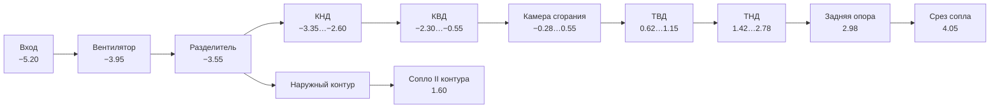

# 02. Геометрия двигателя

## Система координат и масштаб

Ось двигателя — **X**, поток идёт в направлении **+X**. Радиальное направление
лопатки при построении — **+Y**, окружная координата отсчитывается в плоскости
YZ.

1 условная единица = **0.50 м**: вентилятор диаметром 3.12 у.е. соответствует
1.56 м — это CFM56-7B (Boeing 737NG). Полная длина модели от кромки воздухозаборника до
конца центрального тела — 9.95 у.е. ≈ 5.0 м.

Тела вращения строятся через `LatheGeometry` по профилю `[радиус, координата X]`
и разворачиваются `rotation.z = -π/2`, чтобы ось вращения совпала с осью X.
Замкнутый профиль (наружная обшивка назад, внутренняя вперёд) даёт оболочку
с толщиной за одну операцию — так сделаны мотогондола, корпуса и капоты.

## Станции газовоздушного тракта

Константы объявлены в `ST` (`src/engine.js`):



| Станция | X, у.е. | Что там |
|---|---:|---|
| `lip` | −5.20 | Передняя кромка воздухозаборника |
| `fan` | −3.95 | Плоскость вентилятора, радиус конца лопатки 1.56 |
| `splitter` | −3.55 | Разделитель контуров |
| `boosterIn…Out` | −3.35…−2.60 | Подпорные ступени |
| `hpcIn…Out` | −2.30…−0.55 | Компрессор высокого давления |
| `combIn…Out` | −0.28…0.55 | Кольцевая камера сгорания |
| `hptIn…Out` | 0.62…1.15 | Турбина высокого давления |
| `lptIn…Out` | 1.42…2.78 | Турбина низкого давления |
| `frame` | 2.98 | Задняя опора, силовые стойки |
| `bypassExit` | 1.60 | Срез сопла наружного контура |
| `coreExit` | 4.05 | Срез сопла внутреннего контура |
| `plugTip` | 4.75 | Конец центрального тела |

## Состав узлов

| Узел | Что смоделировано |
|---|---|
| Мотогондола | Обечайка воздухозаборника, блестящая металлическая кромка, капоты, пилон крепления к крылу |
| Вентилятор | 24 широкохордные лопатки со стреловидностью и наклоном, кок со спиралью, диск |
| Спрямляющий аппарат | 44 лопатки в наружном контуре |
| КНД | 3 ступени ротора (34/40/46 лопаток) + направляющие аппараты, разделитель контуров, корпус |
| КВД | 10 ступеней ротора (40…94 лопатки, растёт от ступени к ступени) + 10 направляющих аппаратов, барабан ротора, корпус |
| Камера сгорания | Диффузор, наружная и внутренняя стенки жаровой трубы, купол, 20 форсунок с завихрителями, объёмное пламя на шейдере |
| ТВД | 2 ступени (62 и 74 лопатки) + сопловые аппараты (44 и 50), диски |
| ТНД | 5 ступеней (82…106 лопаток) + сопловые аппараты (68…84), диски |
| Задняя опора и сопло | 10 силовых стоек, сужающееся сопло, центральное тело |
| Валы | Вал НД внутри полого вала ВД, фланцы, 4 подшипниковые опоры |
| Агрегаты | Коробка приводов, три агрегата, вертикальная передача, трубопроводы |

Число лопаток растёт по тракту (в компрессоре от ступени к ступени, в турбине от
ТВД к ТНД) — так же, как в реальных двигателях: при уменьшении высоты
проточной части сохраняется густота решётки.

Число лопаток вентилятора — 24, как у CFM56-7B. Это не косметика: от него
напрямую зависит частота следования лопаток, на которой строится тональная
часть звука (см. [документ о звуке](06-sound.md)).

## Спираль на коке

Спираль существует, чтобы её было видно: на стоянке и малых оборотах она
показывает наземному персоналу, что двигатель работает. Но глаз усредняет
картинку примерно за 1/25 с, и уже на средних оборотах спираль заметает полный
круг — остаётся ровное кольцо, а на взлётном режиме её не видно вовсе.

Смаз считается накоплением. Спираль — `InstancedMesh`, и на оборотах рисуется
несколькими копиями, разложенными по заметённому сектору. Точка кадра, закрытая
одной копией из `n`, получает прозрачность `1/n` — ровно ту долю времени, которую
спираль реально провела в этой точке, поэтому «краски» на коке столько же,
сколько и было, просто размазана она по кольцу.

```js
spread = 2π · keff^1.4                      // заметённый сектор
ghosts = ⌈1.5 · spread / ширина⌉ + 1        // копии, шагом меньше толщины спирали
opacity = 1 / ghosts
```

Два решения, без которых смаз выглядит неправильно:

**Шаг между копиями меньше угловой толщины самой спирали.** Иначе копии
расходятся, и вместо ровного кольца получается веер отдельных полос. Отсюда
запас в `1.5` и максимум в 56 копий: на взлётном режиме сектор равен полному
кругу, и более редкая раскладка полосила бы.

**Заметённый угол берётся от приведённого режима `keff`, а не от экранной
скорости вращения.** Роторы в модели намеренно замедлены ради читаемости
(см. [физику](03-physics.md)), и по экранной скорости спираль не смазалась бы
никогда. Полная же честность увела бы в другую крайность: настоящий вентилятор
и на малом газе делает около 15 оборотов в секунду, спираль пропадала бы сразу
после запуска. Привязка к `keff` — компромисс: на малом газе спираль читается,
к взлётному режиму исчезает, на выбеге возвращается.

Проверяется в `test/spiral-blur.test.mjs`, в том числе на неразъезжание копий.

## Генератор лопаток (`src/blade.js`)

Лопатка — не примитив и не набор коробок. Строится протягиванием
аэродинамического профиля по радиусу.

**1. Профиль сечения.** NACA-подобный: распределение толщины

```
y_t(x) = 5·T·(0.2969·√x − 0.1260·x − 0.3516·x² + 0.2843·x³ − 0.1036·x⁴)
```

и средняя линия с максимальной кривизной `M` в точке `p`:

```
x < p:   y_c = M/p²·(2px − x²)
x ≥ p:   y_c = M/(1−p)²·(1 − 2p + 2px − x²)
```

Верхняя и нижняя поверхности откладываются по нормали к средней линии, точки
сгущаются к передней и задней кромкам по косинусному закону.

**2. Протягивание по радиусу.** На каждом из радиальных сечений линейно
интерполируются хорда, угол установки, толщина и кривизна. Точка профиля
`(c, n)` переводится в осевую и окружную координаты через угол установки `θ`:

```
axial = x₀ + sweep·s² + (c−0.5)·chord·cos θ − n·chord·sin θ
tang  =      lean·s²  + (c−0.5)·chord·sin θ + n·chord·cos θ
```

**3. Обёртка по окружности.** Плоское сечение не переносится в пространство
как есть — оно накладывается на цилиндрическую поверхность:

```
φ = tang / r,   y = r·cos φ,   z = r·sin φ
```

Именно так профили задаются в реальном проектировании — на цилиндрических
поверхностях тока. Без этого широкохордная лопатка вентилятора выглядела бы
плоской пластиной.

Параметры генератора: радиусы комля и периферии, хорды, углы установки, толщины,
кривизны, стреловидность (`sweep`), окружной наклон (`lean`), число сечений по
радиусу и точек по хорде. Венец собирается функцией `bladeRow()` в
`InstancedMesh` с поворотом каждой лопатки на `2πi/N`.

Физический смысл закрутки лопатки от комля к периферии — в
[документе о физике](03-physics.md#закрутка-лопаток).

## Материалы

Материалы разделены на две группы. **Оболочки** (`getShellMaterials()`) —
мотогондола, капоты, корпуса, жаровая труба: только к ним применяются плоскости
отсечения и прозрачность, поэтому при разрезе роторы остаются целыми.
Остальные — лопатки, диски, валы, агрегаты — не режутся никогда.

Палитра: композит (тёмный, для лопаток вентилятора), титан, сталь,
никелевый сплав и «горячий металл» с эмиссией для турбины, окрашенный металл
для мотогондолы. Окружение — `RoomEnvironment` через `PMREMGenerator`,
поэтому металл получает правдоподобные отражения без единого файла текстуры.
