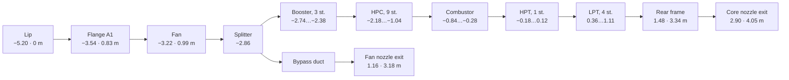

# 02. Engine geometry

## Coordinate system and scale

The engine axis is **X**, the flow goes towards **+X**. The radial direction of
a blade as it is built is **+Y**, and the circumferential coordinate is measured
in the YZ plane.

1 model unit = **0.50 m**. Because of that factor, a radius in model units is
numerically equal to a diameter in metres — `fanTip = 1.549` is a fan of
Ø 1.549 m, `nacelleR = 2.44` is a nacelle of Ø 2.44 m. The coincidence is
convenient: reference diameters go into the code without conversion.

Longitudinal stations are measured from the intake leading edge; it sits at
`x = −5.2`, so a station in metres from the lip equals `(x + 5.2) / 2`. The
overall length of the model from the lip to the plug tip is 10.0 units = 5.0 m.

All dimensions come from the reference file
[`engines/cfm56-7b-nacelle.json`](engines/cfm56-7b-nacelle.json) — see
[Dimensions from sources](#dimensions-from-sources) below.

Surfaces of revolution are built through `LatheGeometry` from a profile of
`[radius, X coordinate]` and rotated by `rotation.z = -π/2` so that the axis of
revolution coincides with X. A closed profile (outer skin running aft, inner one
running forward) gives a shell with thickness in a single operation — that is
how the nacelle, the casings and the cowls are made.

`lathe()` joins the points it is given with straight lines, which is right for a
casing but wrong for the nacelle: the creases between the segments catch the
light and the skin reads as a faceted body. The outer skin is therefore passed
through `smoothProfile()` first — a spline through the twelve control points,
resampled at even spacing into 64 points, about one every 55 mm of skin. That is
where the extra 13 thousand triangles over the old profile go.

## Gas path stations

The constants are declared in `ST` (`src/engine.js`):



| Station | X, units | m from the lip | What is there |
|---|---:|---:|---|
| `lip` | −5.20 | 0 | Leading edge (highlight), Ø 1.70 m |
| `throat` | −4.94 | 0.13 | Intake throat, Ø 1.52 m |
| `a1` | −3.54 | 0.83 | Flange A1: joint with the fan case |
| `fan` | −3.22 | 0.99 | Fan plane, blade tip radius 1.549 |
| `splitter` | −2.86 | 1.17 | Flow splitter |
| `boosterIn…Out` | −2.74…−2.38 | 1.23…1.41 | Booster stages, 3 |
| `hpcIn…Out` | −2.18…−1.04 | 1.51…2.08 | High-pressure compressor, 9 |
| `combIn…Out` | −0.84…−0.28 | 2.18…2.46 | Annular combustor |
| `hptIn…Out` | −0.18…0.12 | 2.51…2.66 | High-pressure turbine, 1 |
| `lptIn…Out` | 0.36…1.11 | 2.78…3.16 | Low-pressure turbine, 4 |
| `frame` | 1.48 | 3.34 | Rear frame, also the engine rear flange |
| `bypassExit` | 1.16 | 3.18 | Fan nozzle exit |
| `coreExit` | 2.90 | 4.05 | Core nozzle exit |
| `plugTip` | 4.80 | 5.00 | Plug tip |

Between flange A1 and the rear frame there are 2.51 m — the published length of
a bare CFM56-7B. Everything ahead of A1 is the intake (0.83 m); everything aft
of the rear frame is the nozzle and the plug.

## Dimensions from sources

The dimensions used to be chosen by proportion. Now each of them is taken from
the [prototype reference data](engines/cfm56-7b-nacelle.json), and any
divergence is caught by `test/geometry.test.mjs` — the test reads the values
straight from the JSON, so editing the reference breaks the test rather than
silently breaking the model.

| Dimension | Reference | In the model | Source |
|---|---:|---:|---|
| Largest nacelle dimension | 2.44 m | `nacelleR` = 2.44 | Boeing ACAP, callout "APPROX 8 FT" |
| Nacelle height | 2.40 ± 0.2 m | 2.28 m over the skin | drawing measurement, top obscured by the wing |
| Width of the flat bottom | 1.2 ± 0.2 m | 1.21 m | drawing measurement |
| Lip → fan nozzle exit | 3.18 m | `bypassExit` | drawing measurement |
| Lip → core nozzle exit | 4.05 m | `coreExit` | drawing measurement |
| Lip → plug tip | 5.00 m | `plugTip` | drawing measurement |
| Nacelle fineness ratio | 1.66 | 1.66 | 4.05 / 2.44 |
| Fan diameter | 1.549 m | `fanTip` = 1.549 | b737.org.uk |
| Largest fan blade chord | 0.279 m | `tipChord` = 0.558 | NTSB AAR-19/03 |
| Fan blades | 24 | 24 | NTSB AAR-19/03 |
| Engine length between flanges | 2.508 m | `frame − a1` = 2.51 m | EASA TCDS E.004 |
| Engine height | 1.829 m | `caseR` = 1.829 | EASA TCDS E.004 |
| Engine width | 2.118 m | `accR` = 2.118 | EASA TCDS E.004 |
| Engine tilt | 5° nose up | pylon wedge | b737.org.uk |
| Intake length / fan diameter | ≈ 0.50 | 0.498 | short-intake patents |
| Stages booster / HPC / HPT / LPT | 3 / 9 / 1 / 4 | 3 / 9 / 1 / 4 | CFM56-7B layout |

Three consequences turned out to be non-obvious.

**The nacelle is fuller than the fan suggests.** The ratio of the largest
dimension to fan diameter on the 737NG is 1.57, whereas on the A320 with the
same CFM56 family it is about 1.37. The cause is that same flat bottom: the
accessory gearbox and the accessories were moved from six o'clock round to the
side, and because of them the overall width of the bare engine is 2.118 m
against a height of 1.829 m. From the accessories to the skin there are 0.16 m
left — the nacelle wraps around them, not around the fan. In the model this is
checked directly: `test/clearance.test.mjs` computes the largest vertex radius
of the accessory module and requires it to match 2.118 and stay under the skin.

**Intake depth cannot be derived from the dimensions — only checked
separately.** The lip, both nozzle exits and the bare engine length are all
given by the reference. But how much of the nacelle length goes to the intake
and how much to the exhaust nozzle it does not say: the sum adds up for any
split. Twice a split was chosen by eye and twice it gave too deep an intake, and
both times it showed only in the picture — the intake read as a tunnel, the fan
sank into the duct, and every dimensional check passed.

The depth is therefore tied to a separate figure: the **ratio of intake length
to fan diameter**. The length here is measured from the foremost point of the
nacelle to the leading edge of the blade tip — exactly what the eye sees when
looking the engine in the face. On a classic nacelle that ratio is about 0.5;
patents on "short intakes" specify 0.20…0.45 and cite 0.5 as the baseline they
depart from.

| Attempt | Intake | Intake length / fan Ø |
|---|---:|---:|
| first | 1.36 m | 0.88 |
| second | 1.04 m | 0.63 |
| **adopted** | **0.83 m** | **0.498** |

The remaining length goes into the exhaust nozzle — 0.71 m aft of the rear
flange. `test/geometry.test.mjs` guards this: it finds the leading edge of the
blade tip directly in the built geometry and requires 0.50 ± 0.06. The general
moral: a dimension obtained by subtraction has to be checked by something
independent of that same subtraction.

**Blade chords are determined by the engine length.** The published 2.508 m
between flanges is divided among 3 booster stages, 9 HPC stages, the combustor,
1 HPT stage and 4 LPT stages — the CFM56-7B layout. From that comes the stage
pitch: 90 mm in the booster, 71 mm in the HPC, 125 mm in the LPT. A row occupies
`chord × cos(stagger)` along the axis, and the rotor and the vanes together have
to fit into that pitch. The chords are therefore set to life-size values —
booster stage 50 mm, HPC stage from 39 down to 24 mm, HPT blade 60 mm, LPT
70 mm. This is not cosmetic: the `clearance` test catches any overlap of rows
whose axial and radial extents both intersect, and `geometry` checks the stage
counts.

## Module composition

| Module | What is modelled |
|---|---|
| Nacelle | Intake barrel with a flattened bottom, polished lip, cowls, wing attachment pylon |
| Fan | 24 wide-chord blades with sweep and lean, spinner with spiral, disc, fan case |
| Outlet guide vanes | 44 vanes in the bypass duct |
| Booster | 3 rotor stages (34/40/46 blades) + stator vanes, flow splitter, casing |
| HP compressor | 9 rotor stages (40…88 blades, growing from stage to stage) + 9 stator rows, rotor drum, casing |
| Combustor | Diffuser, outer and inner walls of the flame tube, dome, 20 fuel nozzles with swirlers, volumetric flame on a shader |
| HP turbine | 1 stage (62 blades) + nozzle guide vanes (44), disc |
| LP turbine | 4 stages (82…100 blades) + nozzle guide vanes (68…80), discs |
| Rear frame and nozzle | 10 struts, converging nozzle, plug |
| Shafts | LP shaft inside the hollow HP shaft, flanges, 4 bearing supports |
| Accessories | Accessory gearbox with accessories, moved from the bottom of the engine to the side, radial drive shaft, pipework |

The blade count grows along the gas path (in the compressor from stage to stage,
in the turbine from HPT to LPT) — just as in real engines: as the annulus height
falls, the cascade solidity is preserved.

The fan blade count is 24, as on the CFM56-7B. This is not cosmetic: the blade
passing frequency, on which the tonal part of the sound is built, depends
directly on it (see the [sound document](06-sound.md)).

## Flat bottom of the nacelle

The 737 nacelle is not round: the bottom and the intake lip are flattened — the
famous "hamster pouch". The reason is not stylistic. The 737 wing sits low above
the ground, and to fit a CFM56 under it the fan diameter was cut down and the
accessory gearbox was moved from underneath the engine to the side — from 6
o'clock to 9. The bottom thus freed up is what got flattened. In the model,
therefore, one makes no sense without the other: the accessories are collected
into a group and rotated 62° about the axis, and only then does the flat bottom
stop contradicting the layout.

The depth of the cut is no longer chosen by eye. It is set by the width of the
flat from the reference: at an outer radius of 2.44 units a chord 1.2 m wide is
cut off at a depth of 0.16 m, hence `BELLY` = 0.32 units. That gives a nacelle
height of 2.44 − 0.16 = 2.28 m — within the tolerance of the measured
2.40 ± 0.2 m. The shortfall to 2.40 is made up by the pylon fairing: head-on it
is exactly what obscured the top, which is what the reference warns about
(`derived_low`, "a lower-bound estimate").

Surfaces of revolution are built by `lathe()`, so the shape is produced by
deforming vertices: the bottom of each section is trimmed to the level `r − d`
with a smooth minimum.

```js
y' = −smoothMin(−y, max(0.4·r, r − d), 0.09·r)
```

Three decisions without which the shape comes out wrong:

**The cowl profile is split into an outer skin and an inner gas path.** It used
to be a single closed generatrix. The split is needed because the two are
flattened differently: outside, the nacelle is flat from the lip to the fan
cowls and becomes round towards the nozzle, while inside the intake must be
round by the time it reaches the fan plane. The clearance between the barrel and
the blade tips there is under 0.1 model units, and a flattened duct would simply
shave them off.

**The cut level is computed from the radius of each vertex, not from an absolute
height.** On a `lathe` ring the radius is constant, so the level is shared by the
whole ring, and the outer and inner surfaces keep their gap. With an absolute cut
they would meet and fight over the depth.

**The fillet at the joint is kept tight (0.09·r).** With a soft transition the
flattening spreads out along the sides and the intake reads as an oval rather
than a circle with its bottom cut off.

The normals are recomputed, otherwise the flat bottom is shaded like a round one
and the shape does not read. `computeVertexNormals()` meanwhile leaves a seam
where `lathe` duplicates vertices at the 0 / 2π joint — the normals of
coincident vertices are averaged in a separate pass.

A known simplification: the gas path in the flow visualisation has remained
axisymmetric (it is given by tables of radii), so right at the lip the bypass
particles poke slightly outside the barrel underneath.

## Markings on the skin

A nacelle with nothing on it reads as a moulded blank: there is nothing on the
surface to take a scale from, and one 2.44 m across looks exactly like one
0.5 m across. `livery.js` draws the joints, the service door, the placards, the
`NO STEP` roundel and the `BOEING 737-800` title into a canvas at start-up and
hands it back as the colour map of the outer skin. There are no image files in
the project, so this is the only way to get them; and one texture on one mesh
costs one draw call, where decals laid over the surface would cost one each and
would z-fight with the skin at the grazing angles most of the nacelle is seen
at.

The placement rides on how `LatheGeometry` lays out UVs: `u` runs around the
circumference, `v` along the profile **by point index**. That is the second
reason the skin is resampled at even spacing — with the raw control points, six
of them crowded into the lip and one for the whole barrel, `v` would be bunched
up at the nose and the title smeared over the cowl. Evenly spaced, `v` is
proportional to distance along the generatrix and a marking can be asked for by
station.

Which way round the texture goes follows from `lathe()`: a vertex at angle φ
ends up at world Y = −r·sin φ, Z = r·cos φ, so `u` = 0 is the +Z side, 0.25 the
bottom, 0.5 the −Z side, 0.75 the top. Nothing is placed on the bottom — that is
where `flattenBelly()` deforms the surface, and it is the one place the paint
would visibly stretch.

Two things are deliberate and look like mistakes:

**The title straddles the joint between the fan cowl and the reverser.** Titles
this size are painted on the assembled nacelle and matched panel to panel;
keeping the whole of it clear of the joint would mean shrinking it to a third of
the size the prototype carries.

**The lettering does not go through `t()`.** These are markings painted on the
hardware, and on real hardware they are in English whatever the language the
interface is set to.

The stations of the two circumferential joints are not free numbers. The forward
one is `ST.a1` — the flange the intake bolts to. The aft one is expressed as a
fraction of the run from `ST.a1` to `ST.bypassExit` rather than as a station of
its own, so that it follows the layout instead of having to be kept in step with
it by hand.

## The 5° engine tilt

The engine on the 737 is installed with 5° of nose-up tilt relative to the
aircraft: this improves ground clearance, deflects the jet downwards and keeps
the pylon cooler. The tilt is given to the **pylon wedge** rather than to the
whole model: underneath, the pylon lies on the nacelle (that is, on the engine
axis), on top it follows the wing chord, and forward those lines converge — at
the front the pylon is thinner by the same 5°. Rotating the whole model instead
cannot be done without cost: the flow visualisation and the screen-space heat
haze (`src/airflow.js`, `src/heathaze.js`) live in world axes and would have to
be rotated after it.

## The spinner spiral

The spiral exists to be seen: at rest and at low speeds it shows ground crew
that the engine is running. But the eye averages the image over roughly 1/25 s,
and already at medium speeds the spiral sweeps a full circle — what is left is
an even ring, and at take-off power it cannot be seen at all.

The smear is treated as accumulation. The spiral is an `InstancedMesh`, and at
speed it is drawn as several copies laid out across the swept sector. A point in
the frame covered by one copy out of `n` gets opacity `1/n` — exactly the
fraction of time the spiral actually spent there, so there is as much "paint" on
the spinner as before, merely smeared around the ring.

```js
spread = 2π · keff^1.4                      // swept sector
ghosts = ⌈1.5 · spread / width⌉ + 1         // copies, stepped closer than the spiral thickness
opacity = 1 / ghosts
```

Two decisions without which the smear looks wrong:

**The step between copies is smaller than the angular thickness of the spiral
itself.** Otherwise the copies spread apart and instead of an even ring there is
a fan of separate stripes. Hence the margin of `1.5` and the maximum of 56
copies: at take-off power the sector is a full circle, and a sparser layout
would produce stripes.

**The swept angle is taken from the effective regime `keff`, not from the
on-screen rotation rate.** The rotors in the model are deliberately slowed for
legibility (see the [physics](03-physics.md)), and by the on-screen rate the
spiral would never smear. Full honesty would go to the other extreme: a real fan
does about 15 revolutions per second even at idle, and the spiral would vanish
right after the start. Tying it to `keff` is the compromise: at idle the spiral
reads, by take-off power it disappears, during rundown it returns.

Checked in `test/spiral-blur.test.mjs`, including that the copies do not spread
apart.

## Blade generator (`src/blade.js`)

A blade is not a primitive nor a set of boxes. It is built by lofting an
aerofoil section along the radius.

**1. Section profile.** NACA-like: the thickness distribution

```
y_t(x) = 5·T·(0.2969·√x − 0.1260·x − 0.3516·x² + 0.2843·x³ − 0.1036·x⁴)
```

and a camber line with maximum camber `M` at position `p`:

```
x < p:   y_c = M/p²·(2px − x²)
x ≥ p:   y_c = M/(1−p)²·(1 − 2p + 2px − x²)
```

The upper and lower surfaces are offset along the normal to the camber line, and
the points are clustered towards the leading and trailing edges by a cosine law.

**2. Lofting along the radius.** At each radial section the chord, stagger
angle, thickness and camber are interpolated linearly. A profile point `(c, n)`
is converted into axial and circumferential coordinates through the stagger
angle `θ`:

```
axial = x₀ + sweep·s² + (c−0.5)·chord·cos θ − n·chord·sin θ
tang  =      lean·s²  + (c−0.5)·chord·sin θ + n·chord·cos θ
```

**3. Wrapping around the circumference.** The flat section is not carried into
space as it is — it is laid onto a cylindrical surface:

```
φ = tang / r,   y = r·cos φ,   z = r·sin φ
```

This is exactly how profiles are defined in real design work — on cylindrical
stream surfaces. Without it a wide-chord fan blade would look like a flat plate.

Generator parameters: hub and tip radii, chords, stagger angles, thicknesses,
cambers, sweep, circumferential lean, the number of radial sections and of
points along the chord. A row is assembled by `bladeRow()` into an
`InstancedMesh` with each blade rotated by `2πi/N`.

The physical meaning of the blade twist from root to tip is in the
[physics document](03-physics.md#blade-twist).

## Materials

The materials are split into two groups. **Shells**
(`getShellMaterials()`) — the nacelle, the cowls, the casings, the flame tube:
only these get the clipping planes and the transparency, which is why the rotors
stay whole in the cutaway. The rest — blades, discs, shafts, accessories — are
never cut.

The palette: composite (dark, for the fan blades), titanium, steel, nickel alloy
and a "hot metal" with emission for the turbine, painted metal for the nacelle.
The environment is `RoomEnvironment` through `PMREMGenerator`, so the metal gets
plausible reflections without a single texture file.
