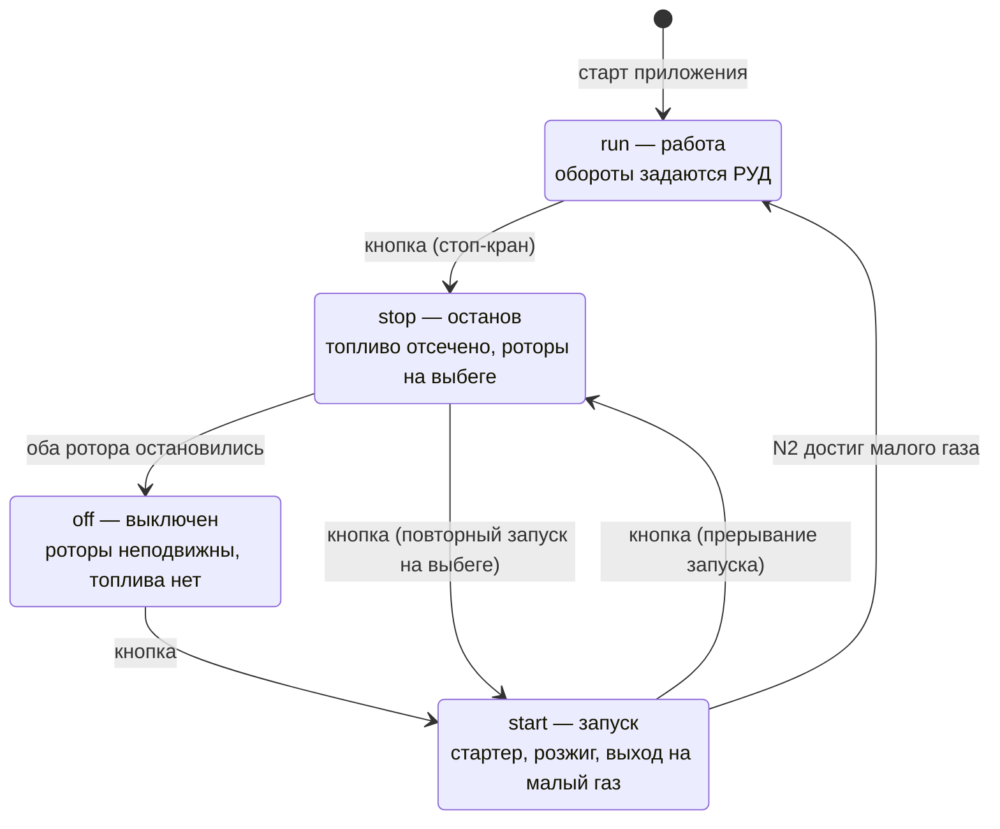

# 05. Режимы работы: запуск, работа, останов

Реализовано в `src/engineState.js` — модуле без зависимостей от Three.js и DOM.
Управляется кнопкой «Запуск / Останов двигателя» или клавишей `E`.

## Автомат состояний



Переходы `start → run` и `stop → off` происходят **внутри автомата**, по факту
достижения оборотов, а не по нажатию кнопки. Поэтому цикл анимации сверяет
`eng.mode` с показанным режимом и обновляет панель при расхождении.

## Останов

Нажатие кнопки в режиме `run` — это стоп-кран: `fuel = 0` мгновенно. Дальше
двигатель доходит до нуля сам, без участия пользователя.

| Что | Когда | Механизм |
|---|---|---|
| Тяга обнуляется | сразу | Тяга считается только при подаче топлива |
| Пламя гаснет | ~1.9 с | `burn` → 0 с постоянной времени 0.35 с |
| Ротор ВД останавливается | ~9.4 с | Экспонента τ = 2.6 с + трение 0.010 /с |
| Ротор НД останавливается | ~14.5 с | Экспонента τ = 4.0 с + трение 0.006 /с |
| Режим переходит в `off` | ~14.5 с | Оба ротора достигли нуля |
| Тракт остывает | десятки секунд | T4 → 15 °C с постоянной времени 7 с |

Что видно и слышно при этом:

* турбина продолжает светиться после того, как пламя погасло — накал привязан к
  фактической T4, а не к РУД;
* частицы потока замедляются вместе с вентилятором, внутренний контур теряет
  цвет — без горения там просто прокачиваемый воздух;
* рёв в звуке пропадает сразу вместе с горением, а вой вентилятора продолжает
  падать по частоте, пока роторы крутятся; после полной остановки — тишина;
* слайдер РУД блокируется: «оживить» остановленный двигатель им нельзя.

Ротор высокого давления встаёт раньше ротора низкого давления — это следствие
разных моментов инерции, см. [физику](03-physics.md#2-динамика-выхода-на-режим-и-выбега).

## Запуск

1. **Раскрутка стартером.** Цель по оборотам ВД — 30 %. Ротор НД в это время
   подхватывается потоком и вращается медленно (`n1 = 0.16 · n2`).
2. **Розжиг** при N2 > 22 %: подаётся топливо, `burn` скачком до 0.45.
3. **Заброс температуры** до ~785 °C: расход воздуха ещё мал, смесь богатая.
4. **Выход на малый газ**: N1 = 18 %, N2 = 56 %, T4 = 495 °C. Занимает ~8 с,
   после чего режим переходит в `run` и РУД разблокируется.

Запуск можно прервать в любой момент — кнопка переведёт двигатель в `stop`.
Так же и наоборот: во время выбега можно запустить двигатель заново.

## Приёмистость

В режиме `run` обороты следуют за РУД не мгновенно, а по апериодическому закону:
разгон медленнее сброса, ротор НД инерционнее ротора ВД. С малого газа до
взлётного двигатель выходит примерно за 11.5 с.

Слайдер работает именно как рычаг управления двигателем: он задаёт **цель**, а
приборы показывают **фактические** обороты. Поэтому при резкой перекладке видно,
как N1 и N2 догоняют команду с разной скоростью.

## Тесты

`npm test` — 16 проверок в `test/engine-state.test.mjs`, автомат прогоняется с
шагом 1/60 с. Тест печатает трассу останова и запуска, что удобно при подборе
постоянных времени:

```
=== ПОЛНЫЙ ОСТАНОВ (с 85 % РУД) ===
исходно: N1=88%  N2=93%  T4=1583°C
  t=  3с  N1= 40%  N2= 27%  T4=1034°C  горение=0.00
  t=  6с  N1= 18%  N2=  7%  T4= 679°C  горение=0.00
  t=  9с  N1=  7%  N2=  0%  T4= 448°C  горение=0.00
  t= 12с  N1=  2%  N2=  0%  T4= 297°C  горение=0.00
  t= 15с  N1=  0%  N2=  0%  T4= 199°C  горение=0.00
пламя погасло: 1.9 с
ротор ВД встал: 9.4 с
ротор НД встал: 14.5 с
```

Проверяемые утверждения перечислены в
[документе о физике](03-physics.md#10-что-проверено-численно).

Тесты появились не для галочки: браузер в безголовом режиме рендерит эту сцену
на программном растеризаторе со скоростью около 1 кадра в секунду, поэтому
пронаблюдать в нём пятнадцатисекундный выбег невозможно. Вынесенный модуль
проверяется за доли секунды.

## Настройка

Все постоянные времени и пороги собраны в начале `src/engineState.js`:

```js
export const IDLE_N1 = 0.18;  // малый газ, доля от максимальных оборотов
export const IDLE_N2 = 0.56;
export const START_N2 = 0.30; // до каких оборотов раскручивает стартер
export const LIGHT_N2 = 0.22; // обороты подачи топлива и розжига
```

Времена выбега (15 с) и запуска (8 с) сжаты относительно реальных 30–60 с
ради демонстрации. Чтобы приблизить к натуре, достаточно увеличить постоянные
времени `tau1`, `tau2` и уменьшить коэффициенты трения в `update()`.
