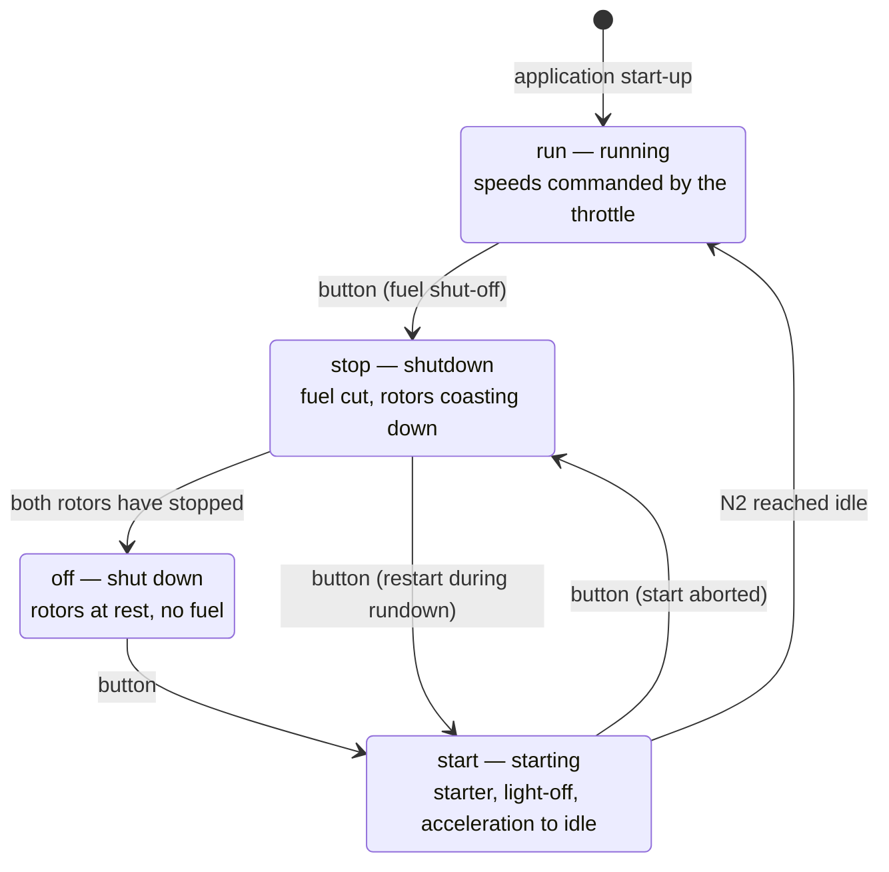

# 05. Operating regimes: start, running, shutdown

Implemented in `src/engineState.js` — a module with no dependency on Three.js or
the DOM. Driven by the "Start / Shut down engine" button or the `E` key.

## State machine



The transitions `start → run` and `stop → off` happen **inside the state
machine**, when the speeds are actually reached, not when a button is pressed.
That is why the animation loop compares `eng.mode` against the displayed mode
and refreshes the panel whenever they differ.

## Shutdown

Pressing the button in `run` mode is a fuel shut-off: `fuel = 0` immediately.
From there the engine reaches zero on its own, without the user.

| What | When | Mechanism |
|---|---|---|
| Thrust goes to zero | immediately | Thrust is computed only while fuel is on |
| Flame dies | ~1.9 s | `burn` → 0 with a time constant of 0.35 s |
| HP rotor stops | ~22.6 s | Exponential τ = 5.9 s + friction 0.0035 /s |
| LP rotor stops | ~35.2 s | Exponential τ = 9.3 s + friction 0.0022 /s |
| Mode changes to `off` | ~35.2 s | Both rotors have reached zero |
| Gas path cools | tens of seconds | T4 → 15 °C with a time constant of 7 s |

The 15 °C the gas path cools to is a fixed number, not the ambient temperature
from the panel: `engineState.js` is deliberately kept free of any dependency,
and altitude was added without touching it. Shut the engine down at eleven
kilometres and the instrument will settle at 15 °C while the intake in the
station table reads −56.5.

What can be seen and heard while this happens:

* the turbine keeps glowing after the flame has died — the incandescence is tied
  to the actual T4, not to the throttle;
* the flow particles slow down together with the fan, and the core duct loses
  its colour — without combustion it is just air being pumped through;
* the roar in the sound disappears at once together with the combustion, while
  the fan whine keeps falling in pitch as long as the rotors turn; after they
  stop, silence;
* the throttle slider is locked: a shut-down engine cannot be revived with it.

The high-pressure rotor stops before the low-pressure one — a consequence of
their different moments of inertia, see the
[physics](03-physics.md#2-dynamics-of-spool-up-and-rundown).

## Start

1. **Starter cranking.** The HP speed target is 30 %. Meanwhile the LP rotor is
   picked up by the flow and turns slowly (`n1 = 0.16 · n2`). This is the
   longest phase: reaching 22 % takes about 16.6 s.
2. **Fuel introduction** at N2 > 22 %. There is no flame yet: the igniters are
   firing, fuel enters the chamber, the gas path stays cold.
3. **Light-off** 2.5 s after fuel introduction (`LIGHT_DELAY`) — `burn` jumps to
   0.45, about 19.1 s into the start.
4. **Temperature overshoot** to about 785 °C: the airflow is still small and the
   mixture rich.
5. **Reaching idle**: N1 = 18 %, N2 = 56 %, T4 = 495 °C. It takes about 39.7 s
   from the beginning, after which the mode changes to `run` and the throttle is
   unlocked.

The start can be aborted at any moment — the button puts the engine into `stop`.
And the other way round: during rundown the engine can be started again.

## Throttle response

In `run` mode the speeds follow the throttle not instantly but by a first-order
lag: acceleration is slower than deceleration, and the LP rotor has more inertia
than the HP one. From idle to take-off power the engine takes about 11.5 s.

The slider behaves exactly like a thrust lever: it sets the **target**, while the
instruments show the **actual** speeds. So a sharp movement makes it visible how
N1 and N2 chase the command at different rates.

## Tests

`npm test` — 20 checks in `test/engine-state.test.mjs`, with the state machine
stepped at 1/60 s. The test prints a trace of the shutdown and the start, which
is convenient when tuning the time constants:

```
=== FULL SHUTDOWN (from 85 % throttle) ===
initially: N1=88%  N2=93%  T4=1583°C
  t=  5s  N1= 50%  N2= 39%  T4= 781°C  burn=0.00
  t= 10s  N1= 29%  N2= 15%  T4= 391°C  burn=0.00
  t= 15s  N1= 16%  N2=  5%  T4= 199°C  burn=0.00
  t= 20s  N1=  8%  N2=  1%  T4= 105°C  burn=0.00
  t= 25s  N1=  4%  N2=  0%  T4=  59°C  burn=0.00
  t= 30s  N1=  2%  N2=  0%  T4=  37°C  burn=0.00
  t= 35s  N1=  0%  N2=  0%  T4=  26°C  burn=0.00
flame out: 1.9 s
HP rotor stopped: 22.6 s
LP rotor stopped: 35.2 s

=== START ===
fuel introduced: 16.6 s (N2 = 22 %)
light-off: 19.1 s
idle reached: 39.7 s
```

The propositions being checked are listed in the
[physics document](03-physics.md#11-what-has-been-verified-numerically).

The tests are not there for show: a headless browser renders this scene on a
software rasteriser at about one frame per second, so watching a fifteen-second
rundown in it is impossible. The extracted module is checked in a fraction of a
second.

## Tuning

All time constants and thresholds are gathered at the top of
`src/engineState.js`:

```js
export const IDLE_N1 = 0.18;    // idle, fraction of maximum speed
export const IDLE_N2 = 0.56;
export const START_N2 = 0.30;   // speed the starter cranks to
export const LIGHT_N2 = 0.22;   // speed at which fuel is introduced
export const LIGHT_DELAY = 2.5; // from fuel introduction to visible flame, s
```

The time constants live in the `TAU` object in the same file and are split by
phase: starter cranking, acceleration to idle, throttle response and
deceleration at operating regimes, rundown. The split is not cosmetic — rotor
acceleration is governed by excess torque, and that differs between these
phases, so a single pair of constants will not do: with a common `τ` the start
came out six times faster than the real thing.

The start (~40 s) and rundown (~35 s) times match the real 30–60 s. To save
waiting through them, the panel offers a **time scale ×1 / ×4**: it multiplies
the step for the engine state machine only (`eng.update(dt · timeScale)`),
leaving the flow particles and the camera alone. The throttle response from idle
to take-off (11.5 s) was deliberately left unchanged — it is already slower than
the real thing.
