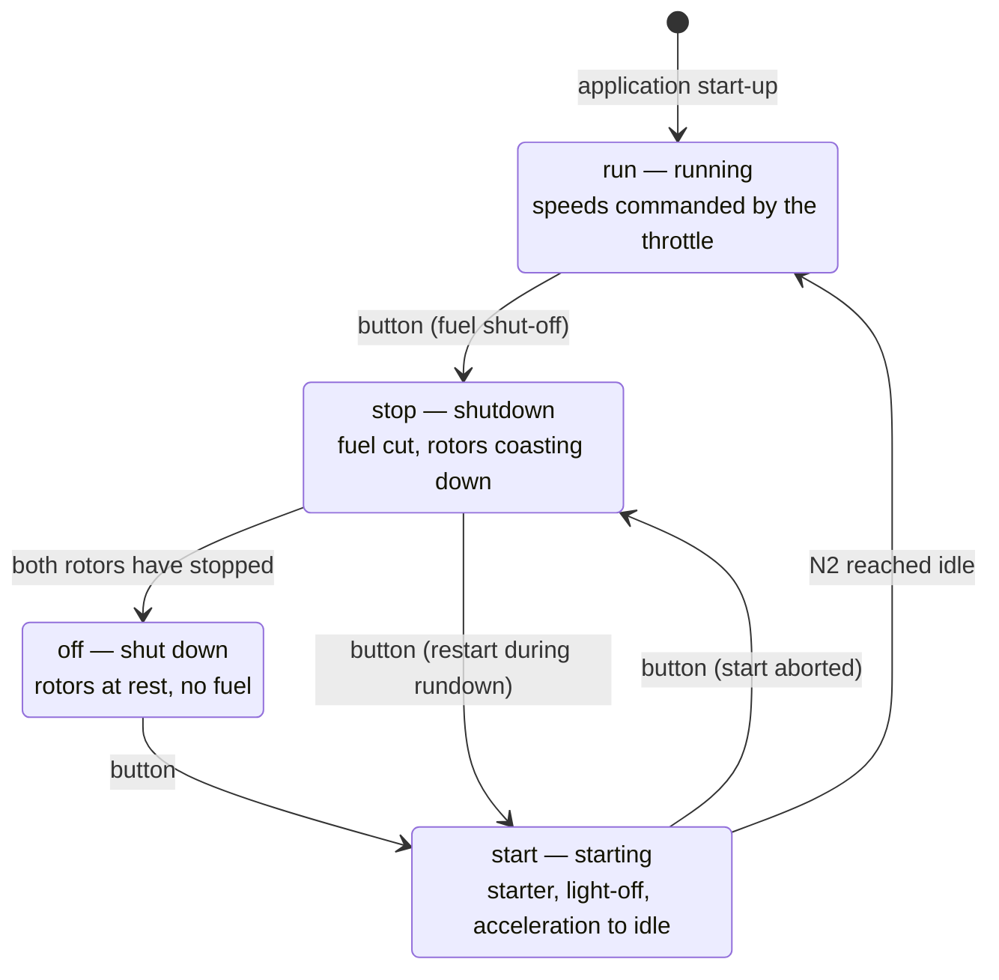
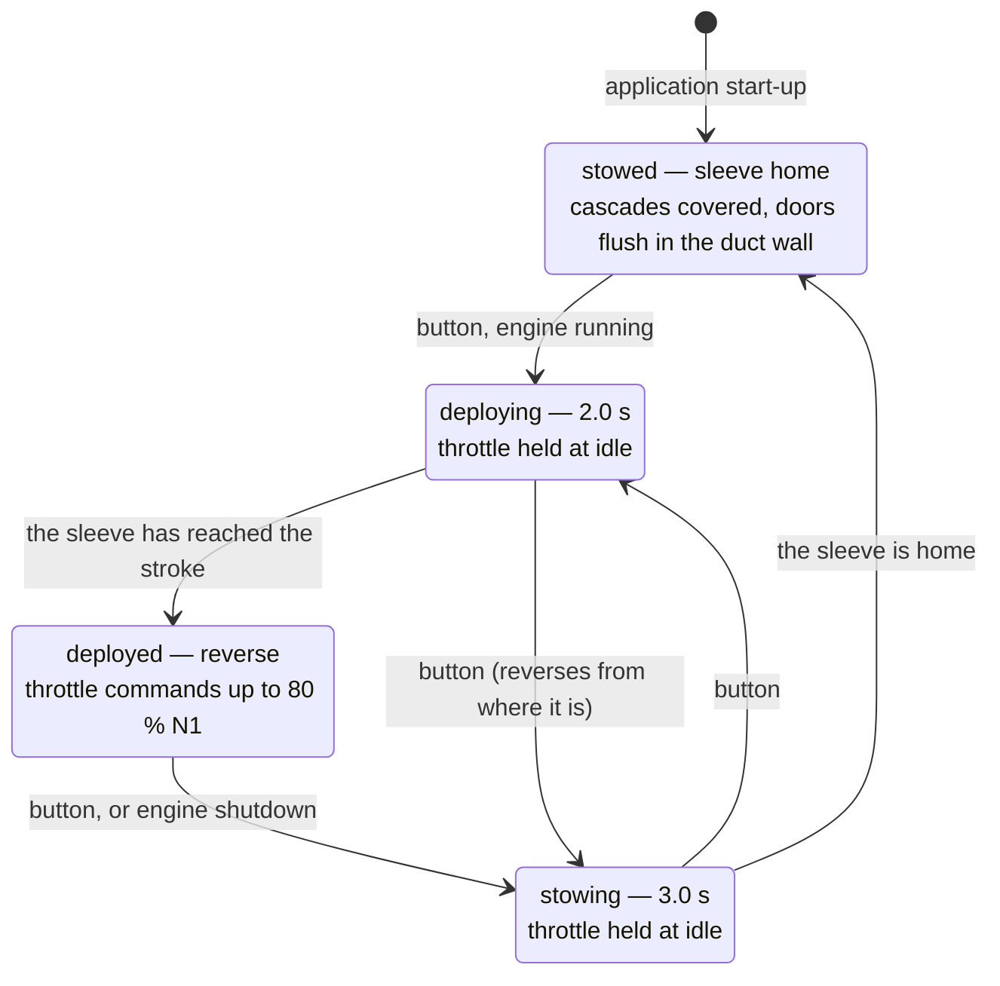
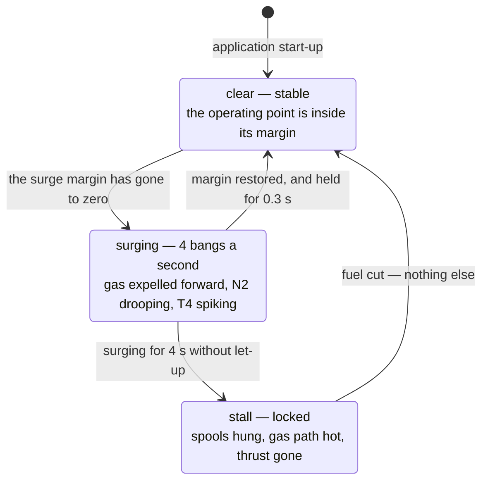

# 05. Operating regimes: start, running, shutdown

Implemented in `src/engineState.js` — a module with no dependency on Three.js or
the DOM. Driven by the "Start / Shut down engine" button or the `E` key.

## State machine



The transitions `start → run` and `stop → off` happen **inside the state
machine**, when the speeds are actually reached, not when a button is pressed.
That is why the animation loop compares `eng.mode` against the displayed mode
and refreshes the panel whenever they differ.

## Shutdown

Pressing the button in `run` mode is a fuel shut-off: `fuel = 0` immediately.
From there the engine reaches zero on its own, without the user.

| What | When | Mechanism |
|---|---|---|
| Thrust goes to zero | immediately | Thrust is computed only while fuel is on |
| Flame dies | ~1.9 s | `burn` → 0 with a time constant of 0.35 s |
| HP rotor stops | ~22.6 s | Exponential τ = 5.9 s + friction 0.0035 /s |
| LP rotor stops | ~35.2 s | Exponential τ = 9.3 s + friction 0.0022 /s |
| Mode changes to `off` | ~35.2 s | Both rotors have reached zero |
| Gas path cools | tens of seconds | T4 → 15 °C with a time constant of 7 s |

The 15 °C the gas path cools to is a fixed number, not the ambient temperature
from the panel: `engineState.js` is deliberately kept free of any dependency,
and altitude was added without touching it. Shut the engine down at eleven
kilometres and the instrument will settle at 15 °C while the intake in the
station table reads −56.5.

What can be seen and heard while this happens:

* the turbine keeps glowing after the flame has died — the incandescence is tied
  to the actual T4, not to the throttle;
* the flow particles slow down together with the fan, and the core duct loses
  its colour — without combustion it is just air being pumped through;
* the roar in the sound disappears at once together with the combustion, while
  the fan whine keeps falling in pitch as long as the rotors turn; after they
  stop, silence;
* the throttle slider is locked: a shut-down engine cannot be revived with it.

The high-pressure rotor stops before the low-pressure one — a consequence of
their different moments of inertia, see the
[physics](03-physics.md#2-dynamics-of-spool-up-and-rundown).

## Start

1. **Starter cranking.** The HP speed target is 30 %. Meanwhile the LP rotor is
   picked up by the flow and turns slowly (`n1 = 0.16 · n2`). This is the
   longest phase: reaching 22 % takes about 16.6 s.
2. **Fuel introduction** at N2 > 22 %. There is no flame yet: the igniters are
   firing, fuel enters the chamber, the gas path stays cold.
3. **Light-off** 2.5 s after fuel introduction (`LIGHT_DELAY`) — `burn` jumps to
   0.45, about 19.1 s into the start.
4. **Temperature overshoot** to about 785 °C: the airflow is still small and the
   mixture rich.
5. **Reaching idle**: N1 = 18 %, N2 = 56 %, T4 = 495 °C. It takes about 39.7 s
   from the beginning, after which the mode changes to `run` and the throttle is
   unlocked.

The start can be aborted at any moment — the button puts the engine into `stop`.
And the other way round: during rundown the engine can be started again.

## Thrust reverser

A second state machine, in `src/reverser.js`, driven by the "Thrust reverser"
button or the `R` key.



As with the engine, the two transitions that are not commanded — `deploying →
deployed` and `stowing → stowed` — happen **inside** the state machine when the
sleeve actually arrives, so the panel is refreshed on a change rather than on a
click.

### Interlocks

The model has no aircraft, so it cannot know about weight on wheels. The
interlocks are written in terms it does have:

| Rule | Behaviour |
|---|---|
| Reverse can only be selected in `run` | The button is disabled in `off`, `start` and `stop`, and the key is ignored |
| Selection commands idle first | The throttle is capped at idle while the sleeve moves, in either direction — as on the aircraft, where the levers must be at idle before the reverse levers will lift |
| The cap drops at once and is eased back | Falling is instant, because an interlock that bites must bite immediately; rising is limited to half the throttle range per second. Released in one frame onto a lever left at the stop it would command a slam, and a slam from idle crosses the stability boundary — reverse would surge every time it was selected |
| Reverse power is limited | Deployed, the throttle commands up to 0.75 of the range: N1 ≈ 80 % |
| Shutdown stows the reverser | The stow takes 3 s against a 35 s rundown, so it always completes; an engine that has stopped is never left with the sleeve out |
| Stow can interrupt a deployment | And deploy can interrupt a stow. Travel is continuous, only its sign changes |
| Repeating a request does nothing | The button is a selector, not a toggle that can be pumped |

The cap is applied to what `main.js` passes to `eng.update()`, not by moving the
slider: the slider is a lever position and levers do not move on their own. The
reverser is updated **before** the engine so the cap belongs to this frame's
sleeve position.

### What can be seen and heard

* the sleeve slides aft, uncovering the cascades, and the twelve blocker doors
  swing across the bypass duct — late in the stroke, because they are dragged
  round by links rather than driven (see
  [geometry](02-geometry.md#the-doors-are-dragged-not-driven));
* N1 falls to idle while the sleeve moves, then climbs to 80 % if the throttle
  is up;
* the thrust read-out crosses zero part-way through the stroke and settles at
  **−19.4 kN**;
* with the flows on, the fan air turns round at the doors and leaves forward and
  outward through the cascades, while the core jet carries on aft exactly as
  before;
* the jet aft narrows to the core alone — it was the two streams mixed, and one
  of them has gone sideways. Nothing shimmers sideways in its place: the
  reversed stream is fan air, and fan air is cold;
* the sound loses the fan jet, the fan broadband gets louder and darker, and the
  cascades roar — 3.6 dB up overall at the same N1
  ([sound](06-sound.md#reverse)).

The model designation on the cowl splits in two as the sleeve carries the aft
half of it away. That happens on the aircraft as well.

## Compressor surge

A third state machine, in `src/surge.js`, driven by **nothing** — there is no
button for it. A surge is a consequence of how the engine is handled, and a
button would have destroyed the only thing it has to teach.



It is a **sub-state of `run`**, not a fifth engine mode. The engine is still
running, the reverser interlock still reads `run`, and the throttle is still
live — and it must be, because pulling it back is the recovery action.

### How to provoke one

Flick the throttle from idle to the stop. The physics is in
[03-physics](03-physics.md#the-compressor-map-and-the-stability-boundary); what
matters at the panel is that it depends on how *fast* the lever moves, because a
slider is dragged rather than stepped:

| Lever from idle to full over | What happens |
|---|---|
| a flick, under 0.5 s | surges |
| about 0.7 s | on the boundary |
| 1 s or slower | no surge |
| 2 s, deliberate | margin never falls below +0.07 |

And on where it starts from: an instantaneous advance from idle surges above a
lever position of **63 %**, while the same slam applied from 30 % power or above
never does. Surge here is a low-speed, fast-movement phenomenon, which is what
it is in life.

The model surges where a real 737 would not, and that is the point rather than a
defect: it has **no acceleration schedule**. Rationing fuel against measured N2
during an acceleration is exactly what a FADEC does, and doing without one is a
better explanation of why that schedule exists than any description of it.

### Two ways out

* **Pull the lever back** within the first few seconds and the fuel command
  collapses, the margin goes positive, and the engine returns to idle stable. It
  can then be accelerated again normally.
* **Leave it up** and after four seconds the surge locks into a **stall**: the
  spools hang near N1 30 % / N2 45 %, the gas path sits above 1700 °C, thrust is
  gone, and no lever movement whatever will clear it. Only a shutdown will.

Both come out of one mechanism rather than being scripted. Each bang costs the
rotors speed; N2 falling drags the reference temperature down with it, so the
margin stays negative and the next cycle follows. Take the fuel away and the
same arithmetic recovers.

### Leaving the lever advanced

Two ordinary situations command a slam without the reader touching the slider,
because something else was holding the throttle down and then let go.

* **A start finishing against an advanced lever.** The engine arrives at idle
  and the lever is where it was left; that is a slam. Below about 61 % the start
  is clean, above it the engine surges the moment it reaches idle. This is the
  model reproducing why the checklist puts the thrust levers at idle before a
  start.
* **The reverser's cap releasing.** This one is *not* left to bite, because a
  deploy-and-stow cycle is two clicks and it would have surged on every one,
  making the documented −19.4 kN unreachable. The cap is eased up instead — see
  the interlock table above.

### What can be seen and heard

* the instruments: N2 steps down on each bang, T4 spikes, thrust collapses, and
  the stability bar reads SURGE and then STALLED;
* the compressor map: the operating point climbs off the working line and into
  the surge line, and drops back when the lever is pulled;
* the flow: core particles are expelled **forward** out of the intake at each
  bang, hot, while the bypass duct carries on untouched — the fan is still being
  driven;
* in a locked stall the expulsion stops and two stall cells travel round the
  annulus at about half rotor speed: the flow is no longer oscillating, it is
  simply bad;
* the sound: a bang a quarter of a second apart over a jet noise that comes and
  goes with the flow.

At the ×4 time scale the surge runs four times as fast, along with everything
else in the state machine. Watch one at ×1.

## Throttle response

In `run` mode the speeds follow the throttle not instantly but by a first-order
lag: acceleration is slower than deceleration, and the LP rotor has more inertia
than the HP one. Advanced from idle to take-off over two seconds, the engine
takes about 12.5 s to get there.

Advanced over two seconds, because since the surge work the model has a
stability boundary and the lever can be moved fast enough to cross it — see
[Compressor surge](#compressor-surge) below.

The slider behaves exactly like a thrust lever: it sets the **target**, while the
instruments show the **actual** speeds. So a sharp movement makes it visible how
N1 and N2 chase the command at different rates.

## Tests

`npm test` — 22 checks in `test/engine-state.test.mjs` and 36 in
`test/reverser.test.mjs`, with both state machines stepped at 1/60 s. The test prints a trace of the shutdown and the start, which
is convenient when tuning the time constants:

```
=== FULL SHUTDOWN (from 85 % throttle) ===
initially: N1=88%  N2=93%  T4=1583°C
  t=  5s  N1= 50%  N2= 39%  T4= 781°C  burn=0.00
  t= 10s  N1= 29%  N2= 15%  T4= 391°C  burn=0.00
  t= 15s  N1= 16%  N2=  5%  T4= 199°C  burn=0.00
  t= 20s  N1=  8%  N2=  1%  T4= 105°C  burn=0.00
  t= 25s  N1=  4%  N2=  0%  T4=  59°C  burn=0.00
  t= 30s  N1=  2%  N2=  0%  T4=  37°C  burn=0.00
  t= 35s  N1=  0%  N2=  0%  T4=  26°C  burn=0.00
flame out: 1.9 s
HP rotor stopped: 22.6 s
LP rotor stopped: 35.2 s

=== START ===
fuel introduced: 16.6 s (N2 = 22 %)
light-off: 19.1 s
idle reached: 39.7 s
```

`test/reverser.test.mjs` prints its own two traces — the deployment, and where
the bypass air ends up:

```
=== DEPLOYMENT ===
  t=0.5s  travel=0.233  door=7.2°   blocked=0.12
  t=1.0s  travel=0.450  door=27.3°  blocked=0.43
  t=1.5s  travel=0.682  door=57.1°  blocked=0.78
  t=2.0s  travel=0.900  door=85.1°  blocked=0.92
fully deployed: 2.02 s

=== WHERE THE BYPASS AIR GOES ===
  stowed:   out of the cascades 0, out of the fan nozzle 1826
  deployed: out of the cascades 1211, out of the fan nozzle 0
```

The second of those is the check that a cascade reverser does nothing to the
core. If it ever fails, the plume, the heat haze and the contrail are wrong too.

The shutdown interlock is driven through the real `createEngineState()` rather
than a mock: the sleeve is home at 3.0 s, the rotors stop at 35.2 s.

The propositions being checked are listed in the
[physics document](03-physics.md#11-what-has-been-verified-numerically).

The tests are not there for show: a headless browser renders this scene on a
software rasteriser at about one frame per second, so watching a fifteen-second
rundown in it is impossible. The extracted module is checked in a fraction of a
second.

## Tuning

All time constants and thresholds are gathered at the top of
`src/engineState.js`:

```js
export const IDLE_N1 = 0.18;    // idle, fraction of maximum speed
export const IDLE_N2 = 0.56;
export const START_N2 = 0.30;   // speed the starter cranks to
export const LIGHT_N2 = 0.22;   // speed at which fuel is introduced
export const LIGHT_DELAY = 2.5; // from fuel introduction to visible flame, s
```

The time constants live in the `TAU` object in the same file and are split by
phase: starter cranking, acceleration to idle, throttle response and
deceleration at operating regimes, rundown. The split is not cosmetic — rotor
acceleration is governed by excess torque, and that differs between these
phases, so a single pair of constants will not do: with a common `τ` the start
came out six times faster than the real thing.

The start (~40 s) and rundown (~35 s) times match the real 30–60 s. To save
waiting through them, the panel offers a **time scale ×1 / ×4**: it multiplies
the step for the engine state machine only (`eng.update(dt · timeScale)`),
leaving the flow particles and the camera alone. The throttle response from idle
to take-off (11.5 s) was deliberately left unchanged — it is already slower than
the real thing.
