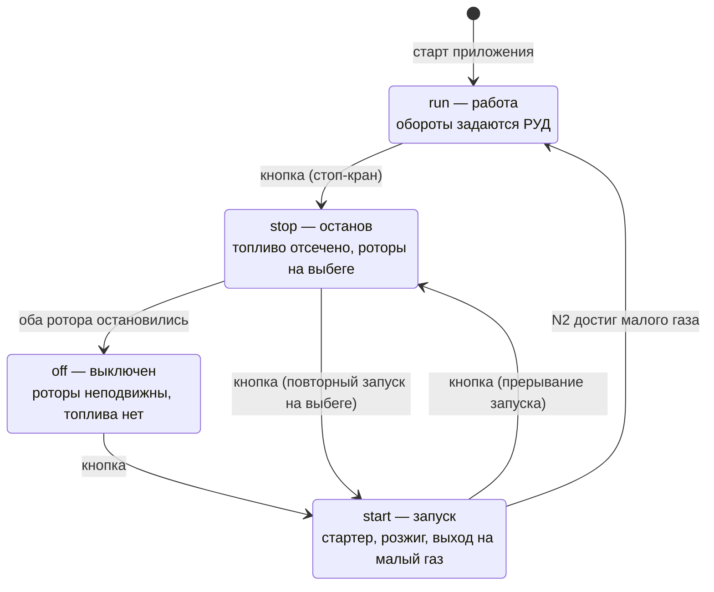

# 05. Режимы работы: запуск, работа, останов

Реализовано в `src/engineState.js` — модуле без зависимостей от Three.js и DOM.
Управляется кнопкой «Запуск / Останов двигателя» или клавишей `E`.

## Автомат состояний



Переходы `start → run` и `stop → off` происходят **внутри автомата**, по факту
достижения оборотов, а не по нажатию кнопки. Поэтому цикл анимации сверяет
`eng.mode` с показанным режимом и обновляет панель при расхождении.

## Останов

Нажатие кнопки в режиме `run` — это стоп-кран: `fuel = 0` мгновенно. Дальше
двигатель доходит до нуля сам, без участия пользователя.

| Что | Когда | Механизм |
|---|---|---|
| Тяга обнуляется | сразу | Тяга считается только при подаче топлива |
| Пламя гаснет | ~1.9 с | `burn` → 0 с постоянной времени 0.35 с |
| Ротор ВД останавливается | ~22.6 с | Экспонента τ = 5.9 с + трение 0.0035 /с |
| Ротор НД останавливается | ~35.2 с | Экспонента τ = 9.3 с + трение 0.0022 /с |
| Режим переходит в `off` | ~35.2 с | Оба ротора достигли нуля |
| Тракт остывает | десятки секунд | T4 → 15 °C с постоянной времени 7 с |

Что видно и слышно при этом:

* турбина продолжает светиться после того, как пламя погасло — накал привязан к
  фактической T4, а не к РУД;
* частицы потока замедляются вместе с вентилятором, внутренний контур теряет
  цвет — без горения там просто прокачиваемый воздух;
* рёв в звуке пропадает сразу вместе с горением, а вой вентилятора продолжает
  падать по частоте, пока роторы крутятся; после полной остановки — тишина;
* слайдер РУД блокируется: «оживить» остановленный двигатель им нельзя.

Ротор высокого давления встаёт раньше ротора низкого давления — это следствие
разных моментов инерции, см. [физику](03-physics.md#2-динамика-выхода-на-режим-и-выбега).

## Запуск

1. **Раскрутка стартером.** Цель по оборотам ВД — 30 %. Ротор НД в это время
   подхватывается потоком и вращается медленно (`n1 = 0.16 · n2`). Этап самый
   длинный: до 22 % оборотов проходит ~16.6 с.
2. **Подача топлива** при N2 > 22 %. Пламени ещё нет: свечи работают, топливо
   поступает в камеру, тракт остаётся холодным.
3. **Розжиг** через 2.5 с после подачи (`LIGHT_DELAY`) — `burn` скачком до 0.45,
   на ~19.1 с от начала запуска.
4. **Заброс температуры** до ~785 °C: расход воздуха ещё мал, смесь богатая.
5. **Выход на малый газ**: N1 = 18 %, N2 = 56 %, T4 = 495 °C. Занимает ~39.7 с
   от начала, после чего режим переходит в `run` и РУД разблокируется.

Запуск можно прервать в любой момент — кнопка переведёт двигатель в `stop`.
Так же и наоборот: во время выбега можно запустить двигатель заново.

## Приёмистость

В режиме `run` обороты следуют за РУД не мгновенно, а по апериодическому закону:
разгон медленнее сброса, ротор НД инерционнее ротора ВД. С малого газа до
взлётного двигатель выходит примерно за 11.5 с.

Слайдер работает именно как рычаг управления двигателем: он задаёт **цель**, а
приборы показывают **фактические** обороты. Поэтому при резкой перекладке видно,
как N1 и N2 догоняют команду с разной скоростью.

## Тесты

`npm test` — 20 проверок в `test/engine-state.test.mjs`, автомат прогоняется с
шагом 1/60 с. Тест печатает трассу останова и запуска, что удобно при подборе
постоянных времени:

```
=== ПОЛНЫЙ ОСТАНОВ (с 85 % РУД) ===
исходно: N1=88%  N2=93%  T4=1583°C
  t=  5с  N1= 50%  N2= 39%  T4= 781°C  горение=0.00
  t= 10с  N1= 29%  N2= 15%  T4= 391°C  горение=0.00
  t= 15с  N1= 16%  N2=  5%  T4= 199°C  горение=0.00
  t= 20с  N1=  8%  N2=  1%  T4= 105°C  горение=0.00
  t= 25с  N1=  4%  N2=  0%  T4=  59°C  горение=0.00
  t= 30с  N1=  2%  N2=  0%  T4=  37°C  горение=0.00
  t= 35с  N1=  0%  N2=  0%  T4=  26°C  горение=0.00
пламя погасло: 1.9 с
ротор ВД встал: 22.6 с
ротор НД встал: 35.2 с

=== ЗАПУСК ===
подача топлива: 16.6 с (N2 = 22 %)
розжиг: 19.1 с
выход на малый газ: 39.7 с
```

Проверяемые утверждения перечислены в
[документе о физике](03-physics.md#10-что-проверено-численно).

Тесты появились не для галочки: браузер в безголовом режиме рендерит эту сцену
на программном растеризаторе со скоростью около 1 кадра в секунду, поэтому
пронаблюдать в нём пятнадцатисекундный выбег невозможно. Вынесенный модуль
проверяется за доли секунды.

## Настройка

Все постоянные времени и пороги собраны в начале `src/engineState.js`:

```js
export const IDLE_N1 = 0.18;    // малый газ, доля от максимальных оборотов
export const IDLE_N2 = 0.56;
export const START_N2 = 0.30;   // до каких оборотов раскручивает стартер
export const LIGHT_N2 = 0.22;   // обороты подачи топлива
export const LIGHT_DELAY = 2.5; // от подачи топлива до появления пламени, с
```

Постоянные времени собраны в объекте `TAU` там же и разделены по этапам:
раскрутка стартером, разгон до малого газа, приёмистость и сброс на рабочих
режимах, выбег. Разделение не косметическое — разгон ротора определяется
избытком момента, а он на этих этапах разный, поэтому одной парой постоянных
обойтись нельзя: с общей `τ` запуск получался вшестеро быстрее натурного.

Времена запуска (~40 с) и выбега (~35 с) соответствуют реальным 30–60 с.
Чтобы не ждать их целиком, в панели есть **скорость времени ×1 / ×4**: она
умножает шаг только для автомата двигателя (`eng.update(dt · timeScale)`),
не трогая ни частицы потока, ни вращение камеры. Приёмистость с малого газа до
взлётного (11.5 с) намеренно не менялась — она и так медленнее натурной.
