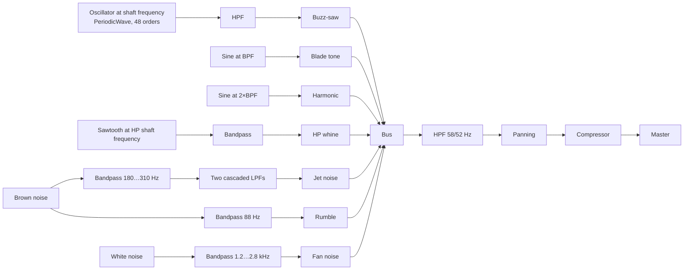

# 06. Sound

Synthesised entirely on the Web Audio API, without a single sound file. Switched
on by the "Engine sound" button or the `S` key — browsers only start an audio
context in response to a user action.

The model is tuned to the **CFM56-7B** (Boeing 737NG) and to a spectral analysis
of real recordings of that engine.

## What the analysis of the recordings showed

Two freely licensed CFM56 recordings were analysed (Freesound, by theplax and
SoundsLikeYukon): a take-off flyover and ground running. The analysis scripts
live in [`test/audio/`](../test/audio), and the method is described below.

### 1. The tones sit on harmonics of the shaft frequency, not only on the blade passing frequency

In four independent eight-second windows, fitting a comb gave one and the same
rotation frequency of the low-pressure shaft:

| Window | Shaft frequency | Speed | Fraction of 5175 rpm | BPF = 24×shaft |
|---|---:|---:|---:|---:|
| 24 s | 79.04 Hz | 4742 rpm | 92 % | 1897 Hz |
| 36 s | 79.04 Hz | 4742 rpm | 92 % | 1897 Hz |
| 60 s | 79.12 Hz | 4747 rpm | 92 % | 1899 Hz |
| 72 s | 79.42 Hz | 4765 rpm | 92 % | 1906 Hz |

**50…58 % of all the tones found landed on integer orders of that frequency.**
This is independently confirmed by autocorrelation of the spectrum: the comb
spacing comes out at 158 and 237 Hz, i.e. multiples of 79 Hz.

This is **buzz-saw** noise (multiple pure tones). When a blade tip is in
supersonic flow, each blade sends a weak shock wave forward along the intake
duct. The blades differ slightly from one another in setting angle and profile,
so the pattern of shocks repeats not once per blade passing period but once per
**full shaft revolution** — hence the comb of orders.

### 2. The envelope over the orders peaks near the blade passing frequency

| Order | Fraction of BPF | Mean excess over the noise floor |
|---:|---:|---:|
| 1…10 | 0.04…0.42 | +7…+15 dB |
| 21 | 0.88 | **+25 dB** |
| 24 (BPF) | 1.00 | **+24 dB** |
| 28 | 1.17 | **+23 dB** |
| 31 | 1.29 | **+25 dB** |
| 40…48 | 1.67…2.00 | +11…+17 dB |

The peak falls at 0.9…1.3 BPF, which agrees with the literature on buzz-saw
noise. The envelope is heavily **jagged**: neighbouring orders differ by
10…18 dB (order 23 is only +6.5 dB, order 24 is +24 dB, order 25 is +5.4 dB).
That jaggedness is the signature of blade-to-blade scatter; an even comb would
sound like a synthesiser.

### 3. The broadband part is darker than one would expect

Third-octave analysis of the flyover: a peak at 200…315 Hz, −15 dB by 1 kHz and
−30 dB by 2 kHz. Jet noise is concentrated at low frequencies, and that is the
main thing distinguishing a real engine from "white noise with a hum".

## How it is implemented



### The comb from a single oscillator

The measured envelope over 48 orders is loaded into a `PeriodicWave` — a
waveform defined by harmonic amplitudes. **One** oscillator at the shaft
rotation frequency then produces the entire comb at once, and as the speed
changes it slides as a whole, just like on a real engine. The waveform is
band-limited, so there is no aliasing.

```js
const real = new Float32Array(49), imag = new Float32Array(49);
for (let n = 1; n <= 48; n++) {
  const phase = (n * 2.399963) % (Math.PI * 2);  // shocks from different blades are not in phase
  real[n] = BUZZSAW[n - 1] * Math.cos(phase);
  imag[n] = BUZZSAW[n - 1] * Math.sin(phase);
}
combOsc.setPeriodicWave(ctx.createPeriodicWave(real, imag));
combOsc.frequency.value = n1 * 5175 / 60;      // shaft frequency
```

The `BUZZSAW` array is exactly the measured envelope converted from decibels to
relative amplitudes, jaggedness and all.

### Threshold at which buzz-saw appears

The comb is switched on not by an arbitrary speed threshold but by the relative
Mach number at the blade tip, built from the tangential and axial velocities:

```js
u = π · D · n1 · 5175 / 60        // tangential velocity of the blade tip
axial = 150 · (0.3 + 0.7·n1)      // axial velocity at the intake
M = hypot(u, axial) / 340
buzz = smoothstep(M, 0.98, 1.18)
```

| N1 | Relative Mach number | Buzz-saw level | BPF |
|---:|---:|---:|---:|
| 18 % | 0.29 | 0.00 | 373 Hz |
| 50 % | 0.68 | 0.00 | 1035 Hz |
| 70 % | 0.93 | 0.00 | 1449 Hz |
| 80 % | 1.06 | 0.34 | 1656 Hz |
| 92 % | 1.21 | 1.00 | 1904 Hz |
| 100 % | 1.31 | 1.00 | 2070 Hz |

So while taxiing one hears a pure whine at the blade passing frequency, and at
take-off power the characteristic rumbling "sawing" overtone joins it. As the
comb builds up, the pure tone is damped — in reality the energy is redistributed
in favour of the shaft orders.

### The remaining components

| Source | Driven by | Band |
|---|---|---|
| Jet noise | combustion `burn` | peak at 180…310 Hz, two cascaded LPFs for a steep roll-off |
| Rumble | combustion and airflow | bandpass at 88 Hz |
| Fan noise | N1 speed | 1.2…2.8 kHz, wide band |
| HP rotor whine | N2 speed | bandpass at the 4th harmonic of the HP shaft |

The split is fundamental: **tones are tied to rotor speed, noise to combustion
and airflow**. That is why the roar disappears the moment the fuel is cut, while
the fan whine keeps falling in pitch until the rotors stop.

Liveliness is added by two slow oscillators: a wander of the shaft frequency
(0.13 Hz) and a breathing of the jet (0.31 Hz).

## Verification

The module accepts a substitute audio context:

```js
createEngineSound({ makeContext: () => new OfflineAudioContext(1, 44100 * 6, 44100) })
```

The synthesis is rendered offline and put through **the same** analysis as the
real recording. The result:

| Metric | CFM56 recording | Synthesis | |
|---|---:|---:|---|
| Shaft frequency | 79.04 Hz | 79.26 Hz | +0.3 % |
| Blade passing frequency | 1897 Hz | 1902 Hz | +0.3 % |
| Envelope peak | order 28 (1.17 BPF) | order 24 (1.00 BPF) | |
| Comb correlation | 0.54 | 0.81 | the synthesis is more regular |
| **Spectral shape mismatch up to 5 kHz** | — | — | **3.2 dB** |

During tuning the third-octave spectral shape mismatch was reduced from 9.6 dB
to 3.2 dB: the excess of infrasonic content was removed, the jet noise roll-off
was made steeper, and the broadband fan noise was attenuated.

Levels: a peak of 0.52 at take-off power and 0.11 at idle with the volume at
50 % — no clipping. On a stopped engine the output is **exactly zero**.

### What still does not match, and why

* The synthesis is more regular than the recording (comb correlation 0.81
  against 0.54) — the recording contains wind, reflections and extraneous
  sources that blur the structure.
* The synthesis is 4…6 dB brighter in the 2…4 kHz band. This is deliberate: the
  recording was made at a distance, and over such distances air absorbs high
  frequencies noticeably. The virtual listener stands next to the engine, where
  there is almost no absorption.
* The envelope peak of the synthesis falls on order 24, that of the recording on
  order 28 — a discrepancy within one lobe of the envelope.

Agreement in absolute levels was not checked: the recording is uncalibrated, and
its level depends on distance, microphone and recording settings.

## Space

Panning and loudness follow the camera: the centre of the engine is projected
onto the screen, its horizontal coordinate sets the panning and its distance the
loudness. The attenuation is linear; the Doppler effect, absorption in air and
reflections are not modelled. When the tab loses focus the context is suspended.

## Reproducing the measurements

```bash
cd test/audio
./fetch.sh          # downloads the recordings from Freesound (CC, ~7 MB)
python3 orders.py   # sorts the tones by shaft order
python3 compare.py  # compares the recording against the synthesis
```

`compare.py` needs a synthesis file: it is rendered in the browser from an
`OfflineAudioContext` (the procedure is in the header of the script). It
requires `python3`, `numpy`, `scipy` and `ffmpeg`.
