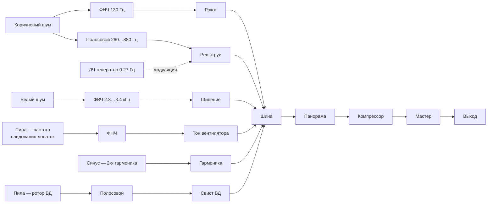

# 06. Звук

Синтезируется на Web Audio API целиком, без единого звукового файла.
Включается кнопкой «Звук двигателя» или клавишей `S` — браузеры запускают
аудиоконтекст только по действию пользователя.

## Граф



Шумовые буферы генерируются один раз на 3 секунды и зацикливаются. Концы буфера
сшиваются перекрёстным затуханием, иначе на стыке петли был бы слышен щелчок
каждые три секунды.

## Привязка к режиму

Сигнатура — `update(n1, n2, burn, pan, nearness)`. Принципиальное разделение:

* **тональные** составляющие привязаны к оборотам;
* **шумовые** — к горению и расходу воздуха.

Именно поэтому при отсечке топлива рёв пропадает сразу, а вой вентилятора
продолжает падать по частоте, пока роторы не остановятся.

Частота основного тона — частота следования лопаток вентилятора:

```
f = (n1 · 3300 об/мин · 22 лопатки) / 60
```

| Режим | N1 | Частота тона |
|---|---:|---:|
| Малый газ | 18 % | 267 Гц |
| Крейсерский | 59 % | 714 Гц |
| Взлётный | 100 % | 1210 Гц |

Уровни составляющих:

```js
rumble = 0.34 · (0.12·n1 + 0.88·burn)          // рокот горения
roar   = 0.03·n1 + 0.42 · burn^1.3             // рёв струи
hiss   = 0.008·n1 + 0.075 · n1^1.6             // шипение воздуха
fan    = (0.012 + 0.058 · n1^0.8) · min(1, 6·n1)
n2tone = (0.006 + 0.030 · n2^1.2) · min(1, 6·n2)
```

Множители `min(1, 6·n)` глушат тоны на самых малых оборотах, а общая шина
домножается на `min(1, 8·max(n1, n2, burn))` — благодаря этому полностью
остановленный двигатель даёт полную тишину, без остаточного гула.

Все изменения идут через `setTargetAtTime`, поэтому перекладка РУД слышна как
плавная раскрутка, а не как скачок частоты.

## Пространство

Панорама и громкость следуют за камерой: центр двигателя проецируется на экран,
и его горизонтальная координата задаёт панораму, а расстояние до камеры —
громкость. Двигатель уезжает влево — звук уезжает влево; камера отъезжает —
звук тише. Ослабление линейное, эффект Доплера и поглощение в воздухе не
моделируются.

При уходе со вкладки аудиоконтекст приостанавливается.

## Проверка

Модуль принимает подменный контекст:

```js
createEngineSound({ makeContext: () => new OfflineAudioContext(2, 44100 * 2, 44100) })
```

Это позволяет отрендерить граф офлайн и измерить результат — иначе о звуке
можно было бы утверждать только «ошибок в консоли нет». Измерено:

| Режим | RMS | Пик (громкость 50 %) | Тон / соседние полосы |
|---|---:|---:|---:|
| Малый газ | 0.028 | 0.099 | ×13 |
| Крейсерский | 0.058 | 0.237 | ×44 |
| Взлётный | 0.097 | 0.393 | ×59 |

То есть уровень монотонно растёт с режимом, клиппинга нет даже на полной
громкости, а тональная составляющая действительно стоит на расчётной частоте
следования лопаток, а не размазана по спектру.
