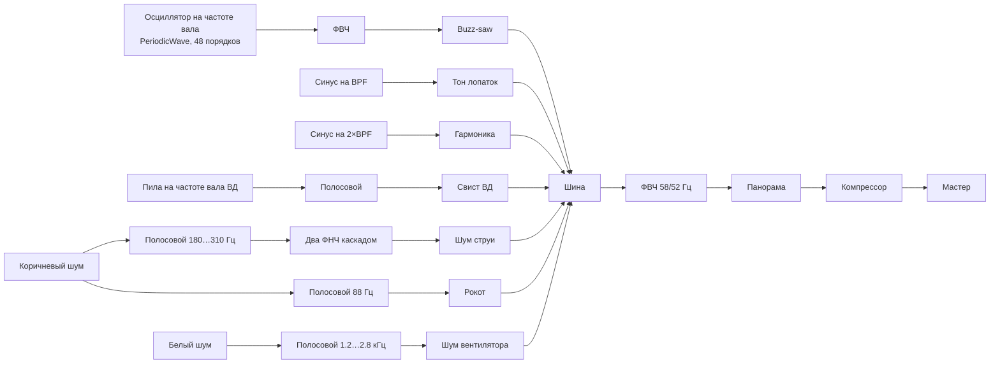

# 06. Звук

Синтезируется на Web Audio API целиком, без единого звукового файла.
Включается кнопкой «Звук двигателя» или клавишей `S` — браузеры запускают
аудиоконтекст только по действию пользователя.

Модель настроена по **CFM56-7B** (Boeing 737NG) и по спектральному анализу
реальных записей этого двигателя.

## Что дал анализ записей

Проанализированы две записи CFM56 со свободной лицензией (Freesound, авторы
theplax и SoundsLikeYukon): пролёт на взлётном режиме и работа на земле.
Скрипты анализа лежат в [`test/audio/`](../test/audio), методика описана ниже.

### 1. Тоны стоят на гармониках частоты вала, а не только на частоте лопаток

В четырёх независимых восьмисекундных окнах подгонка гребёнки дала одну и ту же
частоту вращения вала низкого давления:

| Окно | Частота вала | Обороты | Доля от 5175 об/мин | BPF = 24×вал |
|---|---:|---:|---:|---:|
| 24 с | 79.04 Гц | 4742 об/мин | 92 % | 1897 Гц |
| 36 с | 79.04 Гц | 4742 об/мин | 92 % | 1897 Гц |
| 60 с | 79.12 Гц | 4747 об/мин | 92 % | 1899 Гц |
| 72 с | 79.42 Гц | 4765 об/мин | 92 % | 1906 Гц |

**50…58 % всех найденных тонов легли на целые порядки этой частоты.**
Независимо это подтверждается автокорреляцией спектра: интервал гребёнки
получается 158 и 237 Гц, то есть кратен 79 Гц.

Это и есть **buzz-saw** (multiple pure tones). Когда конец лопатки обтекается
со сверхзвуковой скоростью, от каждой лопатки вперёд по каналу воздухозаборника
уходит слабый скачок уплотнения. Лопатки чуть отличаются друг от друга по
установке и профилю, поэтому картина скачков повторяется не за период следования
лопаток, а за **полный оборот вала** — отсюда гребёнка по порядкам.

### 2. Огибающая по порядкам имеет максимум около частоты следования лопаток

| Порядок | Доля BPF | Среднее превышение над фоном |
|---:|---:|---:|
| 1…10 | 0.04…0.42 | +7…+15 дБ |
| 21 | 0.88 | **+25 дБ** |
| 24 (BPF) | 1.00 | **+24 дБ** |
| 28 | 1.17 | **+23 дБ** |
| 31 | 1.29 | **+25 дБ** |
| 40…48 | 1.67…2.00 | +11…+17 дБ |

Максимум приходится на 0.9…1.3 BPF, что совпадает с литературными данными по
buzz-saw. Огибающая сильно **изрезана**: соседние порядки различаются на 10…18 дБ
(порядок 23 — всего +6.5 дБ, порядок 24 — +24 дБ, порядок 25 — +5.4 дБ). Эта
изрезанность и есть след разброса лопаток; ровная гребёнка звучала бы как
синтезатор.

### 3. Широкополосная часть темнее, чем кажется

Третьоктавный анализ пролёта: максимум на 200…315 Гц, спад −15 дБ к 1 кГц и
−30 дБ к 2 кГц. Шум струи сосредоточен в низких частотах, и это главное, что
отличает звук реального двигателя от «белого шума с гулом».

## Как это реализовано



### Гребёнка из одного осциллятора

Измеренная огибающая по 48 порядкам загружается в `PeriodicWave` — форму волны,
заданную амплитудами гармоник. Тогда **один** осциллятор на частоте вращения
вала даёт сразу всю гребёнку, и при изменении оборотов она едет целиком, как у
настоящего двигателя. Форма волны band-limited, поэтому алиасинга нет.

```js
const real = new Float32Array(49), imag = new Float32Array(49);
for (let n = 1; n <= 48; n++) {
  const phase = (n * 2.399963) % (Math.PI * 2);  // скачки от разных лопаток не синфазны
  real[n] = BUZZSAW[n - 1] * Math.cos(phase);
  imag[n] = BUZZSAW[n - 1] * Math.sin(phase);
}
combOsc.setPeriodicWave(ctx.createPeriodicWave(real, imag));
combOsc.frequency.value = n1 * 5175 / 60;      // частота вала
```

Массив `BUZZSAW` — это ровно измеренная огибающая, переведённая из децибел в
относительные амплитуды, вместе со всей её изрезанностью.

### Порог появления buzz-saw

Гребёнка включается не по произвольному порогу оборотов, а по относительному
числу Маха на конце лопатки — из окружной и осевой скоростей:

```js
u = π · D · n1 · 5175 / 60        // окружная скорость конца лопатки
axial = 150 · (0.3 + 0.7·n1)      // осевая скорость на входе
M = hypot(u, axial) / 340
buzz = smoothstep(M, 0.98, 1.18)
```

| N1 | Относительное число Маха | Уровень buzz-saw | BPF |
|---:|---:|---:|---:|
| 18 % | 0.29 | 0.00 | 373 Гц |
| 50 % | 0.68 | 0.00 | 1035 Гц |
| 70 % | 0.93 | 0.00 | 1449 Гц |
| 80 % | 1.06 | 0.34 | 1656 Гц |
| 92 % | 1.21 | 1.00 | 1904 Гц |
| 100 % | 1.31 | 1.00 | 2070 Гц |

Поэтому на рулении слышен чистый вой на частоте следования лопаток, а на
взлётном режиме к нему добавляется характерный рокочущий «пилящий» призвук.
Когда гребёнка разгорается, чистый тон приглушается — в реальности энергия
перераспределяется в пользу порядков вала.

### Остальные составляющие

| Источник | Привязан к | Полоса |
|---|---|---|
| Шум струи | горению `burn` | максимум 180…310 Гц, каскад из двух ФНЧ для крутого спада |
| Рокот | горению и расходу | полоса 88 Гц |
| Шум вентилятора | оборотам N1 | 1.2…2.8 кГц, широкая полоса |
| Свист ротора ВД | оборотам N2 | полоса на 4-й гармонике вала ВД |

Разделение принципиальное: **тоны привязаны к оборотам, шум — к горению и
расходу воздуха**. Поэтому при отсечке топлива рёв пропадает сразу, а вой
вентилятора продолжает падать по частоте, пока роторы не остановятся.

Живость добавляют два медленных генератора: увод частоты вала (0.13 Гц) и
«дыхание» струи (0.31 Гц).

## Проверка

Модуль принимает подменный аудиоконтекст:

```js
createEngineSound({ makeContext: () => new OfflineAudioContext(1, 44100 * 6, 44100) })
```

Синтез рендерится офлайн и прогоняется через **тот же** анализ, что и реальная
запись. Результат:

| Показатель | Запись CFM56 | Синтез | |
|---|---:|---:|---|
| Частота вала | 79.04 Гц | 79.26 Гц | +0.3 % |
| Частота следования лопаток | 1897 Гц | 1902 Гц | +0.3 % |
| Максимум огибающей | порядок 28 (1.17 BPF) | порядок 24 (1.00 BPF) | |
| Корреляция гребёнки | 0.54 | 0.81 | синтез регулярнее |
| **Расхождение формы спектра до 5 кГц** | — | — | **3.2 дБ** |

По ходу настройки расхождение формы третьоктавного спектра снижено с 9.6 дБ
до 3.2 дБ: убран избыток инфранизких частот, сделан круче спад шума струи,
ослаблен широкополосный шум вентилятора.

Уровни: пик 0.52 на взлётном режиме и 0.11 на малом газе при громкости 50 % —
клиппинга нет. На остановленном двигателе выход **ровно ноль**.

### Что осталось несовпадающим и почему

* Синтез регулярнее записи (корреляция гребёнки 0.81 против 0.54) — в записи
  есть ветер, отражения и посторонние источники, которые размывают структуру.
* Синтез ярче в полосе 2…4 кГц на 4…6 дБ. Это осознанно: запись сделана на
  расстоянии, а на таких дистанциях воздух заметно поглощает высокие частоты.
  Виртуальный слушатель стоит рядом с двигателем, где поглощения почти нет.
* Максимум огибающей у синтеза приходится на 24-й порядок, у записи на 28-й —
  расхождение в пределах одного лепестка огибающей.

Совпадение по абсолютным уровням не проверялось: запись без калибровки, её
уровень зависит от расстояния, микрофона и настроек записи.

## Пространство

Панорама и громкость следуют за камерой: центр двигателя проецируется на экран,
и его горизонтальная координата задаёт панораму, а расстояние — громкость.
Ослабление линейное; эффект Доплера, поглощение в воздухе и отражения не
моделируются. При уходе со вкладки контекст приостанавливается.

## Как повторить измерения

```bash
cd test/audio
./fetch.sh          # скачивает записи с Freesound (CC, ~7 МБ)
python3 orders.py   # раскладка тонов по порядкам вала
python3 compare.py  # сравнение записи и синтеза
```

Для `compare.py` нужен файл синтеза: он рендерится в браузере из
`OfflineAudioContext` (процедура — в шапке скрипта). Нужны `python3`,
`numpy`, `scipy`, `ffmpeg`.
